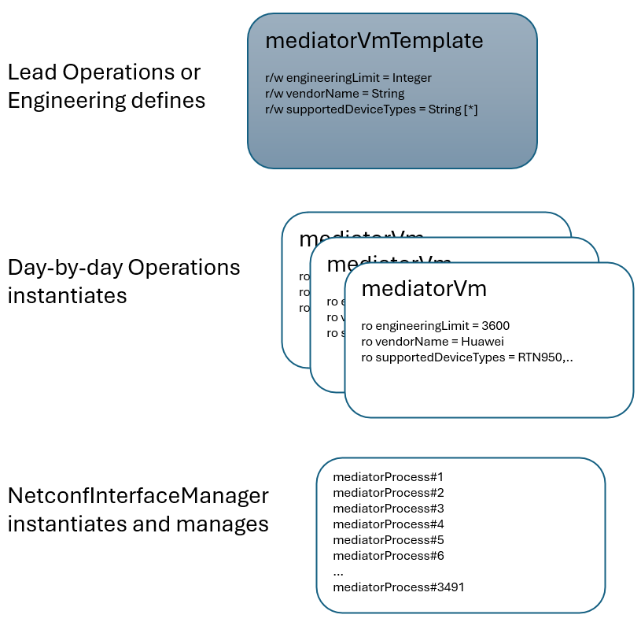

# Basic building blocks  

**The MediatorManager is distinguishing three categories of things**  

- **mediatorVmTemplate**  
The mediatorVmTemplate defines a set of characteristics that are filled with values that are specific to a mediator software. It exists in the MediatorManager only.  
- **mediatorVM**  
The mediatorVM is an actual installation that can be managed via its xMediatorInstanceManager REST interface. The representation of this installation is created as an instance of the corresponding mediatorVmTemplate inside the MediatorManager.  
- **mediatorProcess**  
Thousands of mediatorProcesses are running inside a mediatorVM. The mediatorProcess is the translator that is dedicated to a physical device. Initially the mediatorProcess was often referenced as mediatorInstance, which explains why the management interface at the mediatorVM has been named xMediatorInstanceManager.  

**Static Characteristics of the mediatorVM**  
The mediatorVmTemplate, from which the mediatorVMs were generated, still determines the characteristics of the mediatorVMs even after instantiation.  
(You could also say that the characteristics in the mediatorVmTemplate are defined like static variables that can only be changed in the class (mediatorVmTemplate) but not in the derived objects (mediatorVms).)  

Example:  
If a new device type is added to the list of supported device types at a mediatorVmTemplate, all mediatorVMs that have been generated from this mediatorVmTemplate will connect with this device type in future.  

Remark:  
The risk inherent in lowering the engineering limit in the mediatorVmTemplate is known and accepted.  

**The work process distinguishes the following three stages:**  
Preparation:  
A lead operational expert or engineering expert is creating the mediatorVmTemplate whenever a new mediator software release got delivered. It means that the MediatorManager gets prepared.  

Resource allocation:  
A member of the operational team is creating an instance of the mediatorVmTemplate inside the MediatorManager, whenever a new mediatorVM got instantiated.  

Automated Operation:  
mediatorProcesses get created and dismantled automatically by the MediatorManager after it has been requested to provide a NETCONF interface for a device.  

  