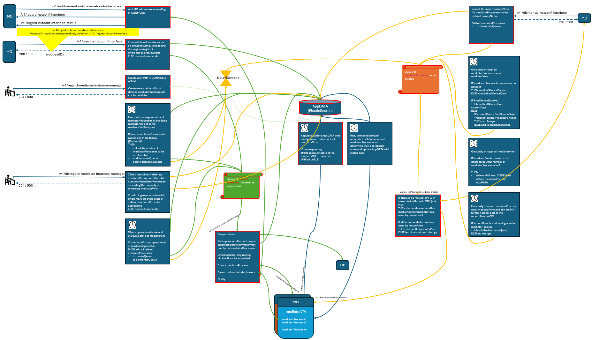

# Automated Operation  

[Needs most likely some update after discussions on Friday 7th of March]

**Autonomously executed Tasks**  
The following tasks are autonomously executed  
- Create the network behind a new NETCONF interface  
- Redistribute load (Mediator processes)  
  - when new resources (mediatorVm) are added  
  - when existing resources are marked as obsolete  
  - when existing resources fail  
- Clean dismantling of the network behind an obsolete NETCONF interface  
- Continuous purging of obsolete configuration artifacts  

**Modules**  
The DeviceDomainManager consists of several modules that communicate with each other.  
This modular structure makes it easier to provide and develop the individual functions independently of each other.  
The following is an overview:  

  

**Code of Conduct**  
The following basic rules are observed when carrying out the above-listed tasks.  
- Never break something that is operational  
- Seize opportunities when something is not working  
- Do the task completely or not at all  
- Clean up after the task has been completed  

**/v1/regard-mediator-instance-manager**  
A new mediatorVm is created from the referenced mediatorVmTemplate.  

**/v1/provide-netconf-interface**  
The following tests are done before sending the response:  
- Is there a mediatorVm that is able to provide mediatorProcesses for the defined device model?  
- Is it feasible to instantiate another mediatorProcesses without exceeding the engineering limit?  
- ...  
If all tests have been passed, the demand for creating a NETCONF interface for that device is added to the createQueue.  

**LoadSharingModule**
The LoadSharingModule is continuously executing the following tasks:  
- Count the number of mediatorVms that have been created from the same mediatorVmTemplate  
  mediatorVms that are not operational or marked deprecated are not counted  
- Count the number of mediatorProcesses that have been created at mediatorVms from the same mediatorVmTemplate  
- Calculate the average number of mediatorProcesses per mediatorVm  
- Search for mediatorVms that are exceeding the average number of mediatorProcesses by more than a threshold, which is defined in a configurable IntegerProfile  
- Calculate the number of mediatorProcesses that have to be re-allocated for lowing their number down to the calculated average  
- Select the calculated amount of NETCONF interfaces by random and add them to the createQueue  
- Add the selected mediatorProcesses to the dismantleQueue  

**StatusMonitoringModule**
The StatusMonitoringModule is continuously executing the following tasks:  
- Check the operational state of a mediatorVm, by **_???_**
- Check the life cycle state of a mediatorVm
- IF either operational state not active or life cycle state deprecated
  THEN add all NETCONF interfaces supported by mediatorProcesses at this mediatorVm to the createQueue  

  

**/p1/create-new-netconf-interface**

Whenever its MM://v1/provide-netconf-interface service is addressed, it  
- filters for mediatorVms that are able to connect the specified kind of device  
- filters for mediatorVms that did not yet reach their engineering limit  
- compares the load on the filtered mediatorVms and choses the one with the lowest load  
- creates a mediatorProcess on that mediatorVm  

_**[The rest of the chapter is half cooked and needs to be discussed and updated together.]**_

A prerequisite for creating or modifying a mediator is that the IP address provided as an input is not used for an existing mediator instance with another mount name in connected state.  
During creating a mediatorProcess, the following aspects have to be considered:  
| mount-name already exist | ip-address already exist | for the expected mount-name + ip-address combination | ping test succeeds | consequence |
|-|-|-|-|-|
| yes  | yes  | yes  | | return 200  |
| yes  | no  | ./.  | |   |
| no/yes  | yes  | no  | | reject with **response 409 "IP Address occupied by \<mountname>“**   |
| no  | no  | ./.  | yes | create mediator instance  |
| no  | no  | ./.  | no | return 532 |

**/v1/dismantle-netconf-interface**  
Whenever its MM://v1/dismantle-netconf-interface service is addressed, the MM  
- searches all mediatorVms for mediatorProcesses that are connecting the specified device  
- deletes all found mediatorProcesses  

**/v1/disregard-mediator-instance-manager**

_**[The rest of the chapter is half cooked and needs to be discussed and updated together.]**_

During deleting a mediatorProcess, the following aspects have to be considered:  
- If a mediatorProcess is still operational, it doesn't get deleted

(Consequently, this means that the MM://v1/dismantle-netconf-interface service could also be used to remove redundant mediatorProcesses without harming the existing NETCONF interface.)
