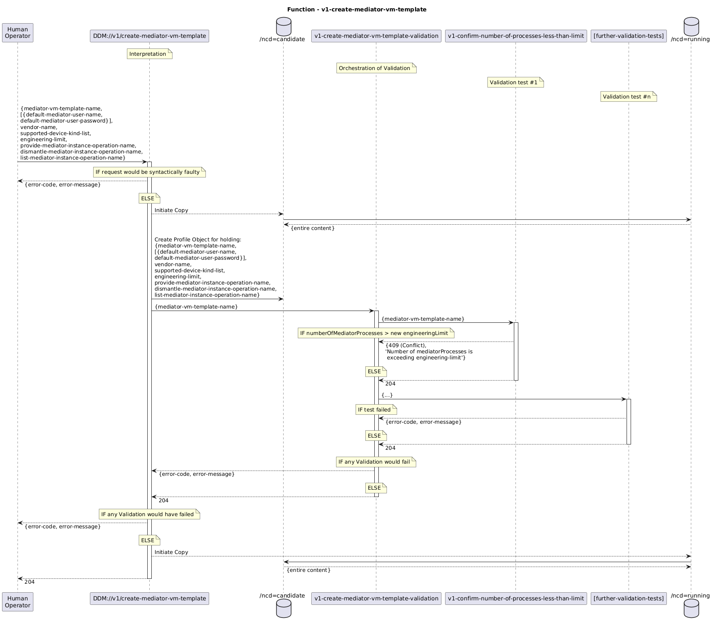

# Functions


## Concept:  

Functions shall be categorized into the following kinds of activities:  
- Interpretation  
  - Abstracted intends (e.g. incoming requests or internal tasks) get translated into creation/change/deletion of concrete logical objects in the CandidateDS  
- Validation  
  - Diverse tests on the content of the CandidateDS  
  - Copying from CandidateDS to RunningDS and vice versa  
  - Orchestration of the process (choosing the correct set of tests, dealing with the composition of tests changing over time, assuring all necessary being executed,...)  
- Measurement  
  - Actual status of the managed elements gets detected and documented into the OperationalDS  
- Management  
  - Divergences between RunningDS and OperationalDS are continuously searched  
  - Detected divergences are classified into error codes and messages (results get documented and notified)  
  - Countermeasures are chosen and scheduled
  - Documentation is updated based on results of countermeasures  
- Implementation  
  - Translating divergences between RunningDS and OperationalDS into concrete creation/change/deletion operations on the managed elements  
  - Transaction management (incl. determining the sequence of operations, pre-test, try run, re-try and potential roll-back, if just a sub-set of operations could be executed successfully)  

Functions shall relate to the following managed objects:  
- ControllerTemplate  
- MediatorVmTemplate  
- DeviceTemplate  
- Controller  
- MediatorVm  
- ManagementPlaneTransportConnection, includes:  
  - Device  
  - mountPoint
  - SnmpConnection  
    - mediatorProcess  
  - NetconfConnection  


## High Level Design of Functions  


### Interpretation  

#### ControllerTemplate  

- functionName: **v1-create-controller-template**  
  t.b.d.
- functionName: **v1-delete-controller-template**  
  t.b.d.
- functionName: **v1-list-controller-templates**  
  t.b.d.

#### MediatorVmTemplate  

- functionName: **v1-create-mediator-vm-template**  
  - public: true  
  - idempotent: true  
  - inputs:  
    - from: request-body#mediator-vm-template-name  
      to: /network-control-domain=candidate/profile=[mediator-vm-template-name]/local-id  
    - from: static default = 'mediator-vm'  
      to: /network-control-domain=candidate/profile=[mediator-vm-template-name]/category  
    - _further attributes according to 06\_MediatorVmTemplate.yaml#profile_  
      to: /network-control-domain=candidate/profile=[mediator-vm-template-name]/[ _same attribute name_ ]  
    - from: request-body#mediator-vm-template-name  
      to v1-create-mediator-vm-template-validation.request-body#mediator-vm-template-name
  - outputs:  
    - to: response-code, {error-code, error-message}  
      from: v1-create-mediator-vm-template-validation.response-code, .response-body  
  - servers:  
    - name: v1-create-mediator-vm-template-validation
  - parameters:
  - comments:  
    - changing templates is made by calling with existing mediator-vm-template-name  
    - incomplete requestBody is accepted for changing templates only  

(click to enlarge example)
  

- functionName: **v1-delete-mediator-vm-template**  
  - public: true  
  - idempotent: true  
  - inputs:  
    - from: request-body#mediator-vm-template-name  
      to v1-delete-mediator-vm-template-validation.request-body#mediator-vm-template-name
    - from: request-body#mediator-vm-template-name  
      to: v1-delete-mediator-vm.request-body#mediator-vm-name with mediator-vm-name==/network-control-domain=candidate/control-construct=*/local-id for all instances with _template==[mediator-vm-template-name]
  - outputs:  
    - to: response-code, {error-code, error-message}  
      from: 
        - 200: if all server.response-code==200
        - 5xx, _error message_: of first server's {error-code, error-message}
  - servers:  
    - name: v1-delete-mediator-vm-template-validation
    - name: v1-delete-mediator-vm
  - parameters:
  - comments:  
    - if not operational, deleting referencing mediatorVms from RunningDS is initiated  

- functionName: **v1-list-mediator-vm-templates**  
  - public: true  
  - idempotent: true  
  - inputs:  
  - outputs:  
    - to: response-body#mediator-vm-templates  
      from: /network-control-domain=running/profile=* for all instances with category=='mediator-vm'
  - servers:  
  - parameters:
  - comments:  

#### DeviceTemplate  

- functionName: **v1-create-device-template**  
  t.b.d.
- functionName: **v1-delete-device-template**  
  t.b.d.
- functionName: **v1-list-device-templates**  
  t.b.d.

#### Controller  

- functionName: **v1-regard-controller**  
  t.b.d.
- functionName: **v1-disregard-controller**  
  t.b.d.
- functionName: **v1-list-controllers**  
  t.b.d.

### Validation  

#### ControllerTemplateValidation  

- functionName: **v1-create-controller-template-validation**  
  t.b.d.
- functionName: **v1-delete-controller-template-validation**  
  t.b.d.

#### MediatorVmTemplateValidation  

- functionName: **v1-create-mediator-vm-template-validation**  
  - public: false  
  - idempotent: true  
  - inputs:  
    - from: request-body#mediator-vm-template-name  
      to: v1-confirm-number-of-processes-less-than-limit.request-body#mediator-vm-template-name
    - _further forwardings to commonly used validation functions to be added_
  - outputs:  
    - to: response-code, {error-code, error-message}  
      from: 
        - 200: if all server.response-code==200
        - 5xx, _error message_: of first server's {error-code, error-message}
  - servers:  
    - name: v1-confirm-number-of-processes-less-than-limit
    - _further commonly used validation functions to be referenced_

- functionName: **v1-delete-mediator-vm-template-validation**  
  - public: false  
  - idempotent: true  
  - inputs:  
    - from: request-body#mediator-vm-template-name  
      to: v1-confirm-template-not-being-operational.request-body#template-name
    - _further forwardings to commonly used validation functions to be added_
  - outputs:  
    - to: response-code, {error-code, error-message}  
      from: 
        - 200: if all server.response-code==200
        - 5xx, _error message_: of first server's {error-code, error-message}
  - servers:  
    - name: v1-confirm-template-not-being-operational
    - _further commonly used validation functions to be referenced_
  - parameters:
  - comments:  

#### DeviceTemplateValidation  

- functionName: **v1-create-device-template-validation**  
  t.b.d.
- functionName: **v1-delete-device-template-validation**  
  t.b.d.

#### ControllerValidation  

- functionName: **v1-regard-controller-validation**  
  t.b.d.
- functionName: **v1-disregard-controller-validation**  
  t.b.d.

#### Common

- functionName: **v1-confirm-number-of-processes-less-than-limit**  
  - public: false  
  - idempotent: true  
  - inputs:  
    - from: request-body#mediator-vm-template-name  
      to: engineering-limit = /network-control-domain=candidate/profile=[mediator-vm-template-name]/engineering-limit  
  - outputs:  
    - to: response-code, {error-code, error-message}  
      from:  
        - 200: if ( numberOf(/network-control-domain=candidate/control-construct=*/logical-termination-point) <= engineering-limit ) for all control-construct with _template==[mediator-vm-template-name]  
        - 409, 'Number of mediatorProcesses is exceeding engineering-limit': if ( numberOf(/network-control-domain=candidate/control-construct=*/logical-termination-point) > engineering-limit ) for any control-construct with _template==[mediator-vm-template-name]  
  - servers:  
  - parameters:
  - comments:  

- functionName: **v1-confirm-template-not-being-operational**  
  - public: false  
  - idempotent: true  
  - inputs:  
    - from: request-body#template-name  
      to: template-name  
  - outputs:  
    - to: response-code, {error-code, error-message}  
      from:  
        - 200: if ( numberOf(/network-control-domain=operational/control-construct) = 0 ) for all control-construct with _template==[template-name]  
        - 423, 'Template in operation': if ( numberOf(/network-control-domain=operational/control-construct) > 0 ) for all control-construct with _template==[template-name]  
  - servers:  
  - parameters:
  - comments:  

.  
.  
-----

### Definition of the Notation

```
functionName:
  type: string
public:
  type: boolean
inputs:
  type: array
  items:
    type: object
    properties:
      from:
        type: string
      to:
        type: string
outputs:
  type: array
  items:
    type: object
    properties:
      to:
        type: string
      from:
        type: string
servers:
  type: string
parameters:
  type: array
    type: string
comments:
  type: array
```

