# Entwicklung einer Architektur für Netzwerkautomatisierungsaufgaben

### Vorgeschichte  
Die ersten Überlegungen zur Automatisierung des Mountings wurden bereits Anfang 2021 gemacht.  

Innerhalb der mediatorVMs werden die einzelnen mediatorProcesses durch eine MediatorInstanceManager Funktion verwaltet.  
Für die herstellerspezifischen Implementierungen der MediatorInstanceManager Funktion wurde eine REST Schnittstelle harmonisiert.  
Über diese REST Schnittstelle ist es nun möglich, den MediatorInstanceManager mediatorProcesses erstellen und löschen zu lassen, ohne die gesamte mediatorVM neu starten zu müssen.  
Dieser Schritt kann als Erfolg angesehen werden, da gegenwärtig über Skripte durchschnittlich ca. 3,500 mediatorProcesses pro mediatorVM verwaltet werden.  

Ferner wurde damals angedacht, dass  
- eine MountingOrchestrator Applikation den gesamten Mountingprozess steuert, die notwendigen Konfigurationen am Controller vornimmt, und bei Bedarf  
- eine MediatorManager Applikation auffordert einen passenden mediatorProcess durch einen der oben erwähnten MediatorInstanceManager in einer der mediatorVMs erstellen zu lassen.  

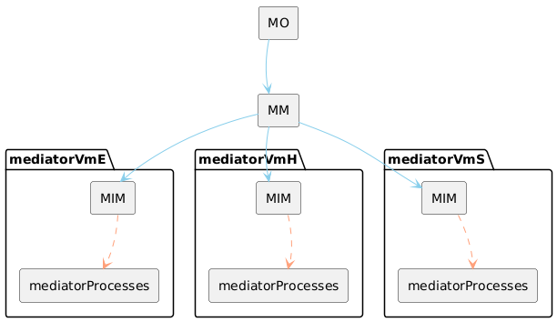  

Im November 2024 wurde die Automatisierung des Mountings erneut angegangen, um damit die Wahrscheinlichkeit einer erfolgreichen Anwendung der automatisierten Linkabnahme zu steigern.  
Auf Basis der bestehenden Konzepte sollte das Mounting so beschleunigt werden, dass der GU zum Zeitpunkt der Linkabnahme noch am Standort ist.  

### Linearer Prozess  
Über APT, bzw. den APT-Proxy sollte zunächst der MountingOrchestrator aufgefordert werden, das neue Gerät zu mounten (2.2), bevor die für die Linkabnahme erforderlichen Daten aus dem Inventory gelesen (3.2) werden.  

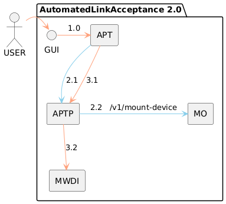  
  
Der Aufruf des MountingOrchestrator (2.2) hatte folgenden Charakter: /v1/mount-device  

Der MountingOrchestrator sollte folgende Aufgaben als linearen Prozesses durchführen:
- Konfigurieren des SDN-Nutzers im Gerät (2.2.1)  
- Erstellen und Konfigurieren des Mediators (2.2.2)  
- Einrichten eines MountPoints am Controller  (2.2.3)  
- Verknüpfen von Plandaten mit Wirknetzinventar durch Eintragen von Ne-ID und Link-ID im Gerät (2.2.4)  

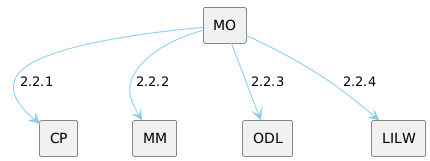  

Im Falle eines Fehlers sollte der MountingOrchestrator den Prozess abbrechen und eine aussagekräftige Fehlermeldung an APTP -> APT -> den Nutzer zurückgeben, so dass dieser am Standort gezielt nachbessern kann.  

Die Fehlermeldungen sollten folgenden Detailierungsgrad aufweisen:  
- Gerät nicht unter der geplanten IP Adresse erreichbar  
- Gerät nicht über Managementprotokoll erreichbar  
- Adminnutzer auf dem Gerät nicht eingerichtet  
- Adminnutzer mit einem falschen Passwort eingerichtet  
- ...  

Es zeigte sich, dass für Fehlermeldungen dieser Auflösung weitere Prozessschritte erforderlich sind.  
- Pingtest prüft, ob das Gerät unter der geplanten IP Adresse erreichbar ist (2.1.1a)  
- Protokolltest prüft, ob die notwendigen Freigaben auf den Routern und Firewalls eingerichtet sind (2.1.1b)  
- ...  

Dem Konzept des linearen Prozesses folgend wurde spezifiziert, dass diese Tests ebenfalls durch den MountingOrchestrator durchgeführt werden.  

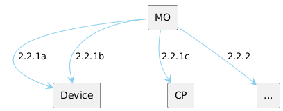  

Nach der Spezifikation weniger Schritte zeigte sich:  
- Ein Orchestrator bekommt bei dieser Architektur sehr viele Schnittstellen. Im Fall des MountingOrchestrators unterschieden sich diese Schnittstellen darüber hinaus technologisch (Ping, SNMP, HTTP...) und waren wiederum redundant mit Schnittstellen, die in den spezialisierten Applikationen (z.B. ConnectionPreparation) ohnehin benötigt werden.  
- Der Orchestrator ist durch so gut wie jede Änderung an den äußeren Bedingungen (in diesem Fall an Hardwareausstattung oder Netzdesign) ebenfalls betroffen. D.h. im einzelnen UserDemand verdoppelt sich der Erhaltungsaufwand, da neben der spezialisierten Applikation fast immer auch der Orchestrator aktualisiert werden muss.  
- Werden UserDemands generell als lineare Prozesse umgesetzt, müssen bei Änderungen neben der spezialisierten Applikation (die durch mehrere UserDemands genutzt wird) unter Umständen gleich mehrere Orchestratoren aktualisiert werden.  

**Erkenntnis**  
Die Implementierung von UserDemands als lineare Prozesse, die von einem Orchestrator über mehrere Applikationen hinweg durchgesteuert werden, scheint in der Anschaffung, aber insbesondere im Unterhalt einer zunehmend umfangreichen Umgebung sehr aufwändig und teuer zu sein.  

### Unterstrukturierter Prozess

In einer ersten Überarbeitung des Designs wurden die Funktionen neu auf die Applikationen verteilt.  

Beispiel zur Steigerung der Kohäsion:  
Pingtest und Protokolltest wurden vom MountingOrchestrator in die ConnectionPreparation Applikation verschoben, so dass die dort bereits vorhandenen Interfaces mehrfach verwendet werden können.  

Beispiel zur Reduzierung der Kopplung:  
Bislang bot die ConnectionPreparation Applikation hardwarespezifische Services an (z.B. /v1/prepare-connection-at-ericsson-ml6352).  
Die Auftrennung in separate Services geschah ursprünglich um eine rückwärtskompatible Wartung und Ergänzung um zukünftige Hardwaretypen zu erleichtern.  
Da dabei die Entscheidung darüber, welche herstellerspezifische Methode anzuwenden ist, im MountingOrchestrator platziert wurde, muss dieser z.B. bei Einführung einer neuen Hardware ebenfalls aktualisiert werden.  
Ein zusätzlicher, generischer Service (/v1/prepare-connection) in der ConnectionPreparation Applikation entscheidet nun anhand eines Gerätetyp-Attributes, welcher der hardwarespezifischen Services aufgerufen werden muss.  
Durch diesen Selbstaufruf der ConnectionPreparation Applikation entfällt der Aktualisierungsbedarf am MountingOrchestrator, da dieser nur einen anderen String durchreichen muss.  

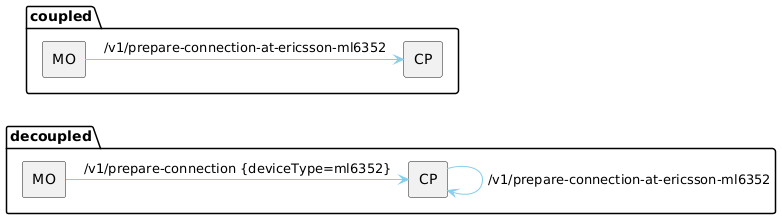  

Ferner wurde berücksichtigt, dass bei wiederholten Versuchen ein Gerät zu mounten das Gerät nicht in jedem Fall erneut vorbereitet werden muss.  
Die Information darüber, ob es vorbereitet werden muss, ist jedoch im MediatorManager, nicht im MountingOrchestrator.  
Unter anderem aus diesem Grund, ist es viel sinnvoller, die ConnectionPreparation Applikation durch den MediatorManager und nicht durch den MountingOrchestrator aufzurufen.  

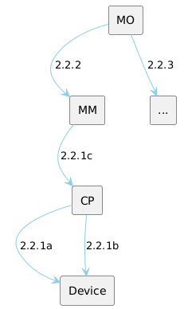  

Steigerung der Kohäsion und Reduzierung der Kopplung haben zur Folge, dass die einzelne Applikation nicht länger nur einzelne Arbeitsschritte im Rahmen eines Prozesses ausführt, sondern eine umfassendere Verantwortung bekommt.  

Beispiele:  
  - Die ConnectionPreparation Applikation kümmert sich nun um die gesamte Kommunikation mit dem Gerät bevor es am Controller angebunden ist.  
  - Der MediatorManager stellt nicht länger nur einen Mediator zu Verfügung, sondern das NETCONF Interface und alles was dahinter liegt, da er die Konfiguration des Interfaces auf der Geräteseite ebenfalls vorbereitet und auslöst.  

Aus diesem Grund wurde aus dem MediatorManager der NetconfInterfaceManager und aus dem /v1/provide-mediator der /v1/provide-netconf-interface (2.2.1) Service.  

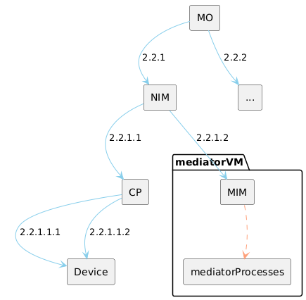  

### Domänen  

Im Rahmen der Designdiskussionen wurde klar, dass neben des Mountings neuer Geräte weitere Aufgaben an den betroffenen Elementen (Controller, mediatorVMs, Geräte) zu erledigen sind.  

Beispiele:  
- Durch frühere, skriptbasierte Mountingversuche ist es auf einigen Geräten zu einer Verschmutzung gekommen. Es wurden in größerer Anzahl falsche Nutzernamen eingetragen. Eine Hygienefunktion wird benötigt. Diese soll autonom dafür sorgen, dass nur die vorgegebenen Nutzer auf den Geräten konfiguriert sind. Diese Funktion wäre idealerweise ebenfalls in der ConnectionPreparation Applikation untergebracht, da sie die selben Designinformationen und Interfaces zu den Geräten benötigt.  
- Durch die permanente Fortentwicklung des Managementinterfaces, liefert jeder Hardwarehersteller mehrmals im Jahr eine aktualisierte Mediatorsoftware.  
Der gegenwärtig genutzte Updateprozess führt zu einem stundenlangen Ausfall der Managementanbindung.  
Der NetconfInterfaceManager könnte durch Aufrufen der vorhandenen Create- und Deleteservices der MediatorInstanceManager auch den Umzug von mediatorProcesses von einer alten zu einer neuen mediatorVm automatisieren und zumindest nahezu unterbrechungsfrei gestalten.  

Diese Beispiele zeigen, wie durch den Aufruf der selben Services auf der selben Gruppe untergeordneter Elemente unterschiedliche übergeordnete Ziele (UserDemands) umgesetzt werden können.  
D.h. die Steigerung der Kohäsion hat nicht nur Einfluss auf die Anordnung der Funktionen eines UserDemands, sondern befördert auch, dass eine Applikation an einer ganzen Reihe von UserDemands beteiligt ist, oder diese sogar eigenständig implementiert.  

Im Falle des NetconfInterfaceManagers zeigte sich, dass die zur Umsetzung der unterschiedlichen UserDemands benötigten Funktionen große Überschneidungen aufweisen.  
z.B. eine Funktion für das Erstellen eines Mediators wird für die Automatisierung des Mountings, die Gleichverteilung der mediatorProcesses über die mediatorVMs, die Automatisierung des Updates der Mediatorsoftware, einen Schutz gegen den Crash von MediatorVMs und eventuell weitere UserDemands benötigt.  

Das bedeutet, dass auch innerhalb der Applikationen Serviceaufrufe, bzw. autonom ausgeführte UserDemands nicht als lineare Prozesse, sondern als Zusammenwirken von wiederverwendbaren Modulen umgesetzt werden sollten.  
Da diese Module für mehrere UserDemands benötigt werden, werden sie offenkundig nicht von außen angestoßen, sondern durch ein internes Ereignis.  
Sie werden von den Applikationen quasi "in Eigenverantwortung" genutzt.  

Um die Wiederverwendbarkeit von Modulen zu verbessern, kann es sich ergeben, dass das auslösende interne Ereignis nicht mehr in unmittelbarem Zusammenhang mit dem einzelnen UserDemand steht.  

Müssen z.B. im Zusammenhang mit dem Rückbau physikalischer Geräte, der Gleichverteilung der mediatorProcesses über die mediatorVMs oder der Automatisierung der Updates der Mediatorsoftware nicht mehr benötigte mediatorProcesses gelöscht werden, könnte das interne Ereignis darin bestehen, dass im Rahmen einer regelmäßigen Prüfung des Bestandes ein nicht mehr benötigter mediatorProcess gefunden wurde.  

**Erkenntnis**  
Konsequentes Optimieren der Architektur hinsichtlich Aufwand und Kosten (durch Steigern der Kohäsion und Reduzieren der Kopplung) führt schließlich zur Bildung von Domänen die relativ autonom agieren.  
Da mehrere Funktionen innerhalb der Domänen parallel wirken, besteht kein 1:1 Zusammenhang zwischen einem äußeren Serviceaufruf (oder einem UserDemand) und einer Funktion zu seiner vollständigen Umsetzung mehr.  
Würde man einen UserDemand (z.B. die Automatisierung des Mountings) als linearen Prozess denken, wäre es vermutlich sehr schwierig nachzuvollziehen, ob alle darin enthaltenen Schritte "irgendwo" abgedeckt sind.  

### Zuschnitt der Domänen  

Beispiel:  
- Wie oben beschrieben, soll der NetconfInterfaceManager einen idealerweise unterbrechungsfreien Prozess zur Aktualisierung der MediatorSoftware implementieren.  
- Hintergrund:  
  - Das MicroWaveDeviceInventory wird vom Controller über Änderungen am Zustand der Managementanbindungen informiert.  
  - Erhält das MicroWaveDeviceInventory eine Notification über das Abreißen einer Managementanbindung, löscht es das betroffene Gerät sofort aus dem Cache.  
  - Das Laden des Datenbaumes eines Gerätes in den Cache dauert im Durchschnitt etwa 8 Minuten.  
  - Das Laden der Datenbäume aller Geräte, die über eine mediatorVM angebunden sind, dauert etwa 2 Stunden.  
- Würde der NetconfInterfaceManager ein neues NETCONF Interface an einer neuen mediatorVM generieren lassen und den MountingOrchestrator auffordern den MountPoint im Controller so umzukonfigurieren, dass dieser auf das neue NETCONF Interface zeigt, käme es während der Konfigurationsänderung zu einer Unterbrechung der NETCONF Verbindung, und der Controller würde eine entsprechende Notifications senden.  
- Offensichtlich ist nicht ideal, dass MountingOrchestrator und NetconfInterfaceManager die Endstellen der NETCONF Verbindungen konfigurieren und der Controller die Notifications über deren operativen Status in den restlichen Applikationslayer sendet.  

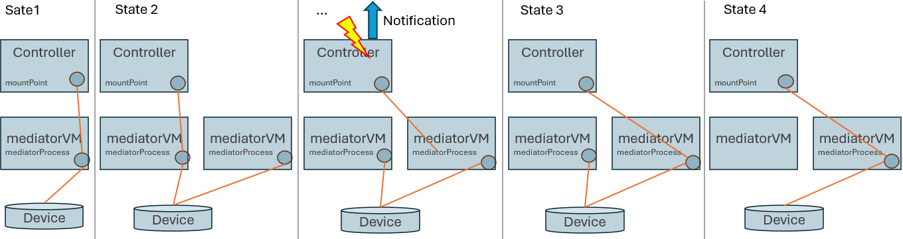  

Eine effektivere Kontrolle erscheint möglich. Hierfür sollte ...  
- die vollständige Verbindungen (nicht nur Interfaces) innerhalb einer Domäne verantwortet werden  
- der Domaincontroller (hier eine Applikation) nicht nur die Konfiguration beider Endstellen der Verbindungen vornehmen, sondern auch darüber entscheiden, welche Notifications von der Domäne nach außen gegeben werden.  

**Erkenntnis**  
Beim Zuschnitt der Domänen sollte in Verbindungen, nicht in Endstellen, gedacht werden.  

Operation Domains:  
Innerhalb des ApplicationPatterns werden die Pfade, die auf einer API angeboten oder als Callbacks angesprochen werden, als OperationServer und OperationClient Objekte verwaltet.  
- Wenn eine beliebige Applikation innerhalb der MW SDN Domäne das MicroWaveDeviceInventory adressiert, um Informationen über ein Gerät zu bekommen, geschieht dies über einen Pfad (OperationServer), der wie folgt strukturiert ist:  
/core-model-1-4:network-control-domain=live/control-construct={mountName}/equipment={uuid}  
Offensichtlich befinden sich unterhalb des MicroWaveDeviceInventory die zwei Subdomänen Cache und Live, die parallel neben einander existieren.  
- Sobald die Anfrage über einen OperationClient des MicroWaveDeviceInventory in die Live Domäne übertragen wurde, ist der Pfad wie folgt strukturiert:  
/rests/data/network-topology:network-topology/topology=topology-netconf/node={mountName}/yang-ext:mount/core-model-1-4:control-construct/equipment={uuid}
Innerhalb dieses Pfades werden zwei neue Ebenen von Subdomänen aufgespannt.
  - Es werden Domänen für verschiedene Protokolle unterschieden.  
  Da wir gegenwärtig ausschließlich NETCONF nutzen, wird diese Zwischenebene nicht weiter betrachtet.  
  - Innerhalb der NETCONF Domäne wird für jedes der Geräte eine eigene Domäne aufgespannt.  
- Sobald die Anfrage über den MountPoint im Controller in die Domäne eines Gerätes übertragen wurde, ist der Pfad wie folgt strukturiert:  
/core-model-1-4:control-construct/equipment={uuid}

Innerhalb der Domäne eines Gerätes ist eine Unterscheidung in Live und Cache unbekannt, dass weitere Geräte parallel existieren könnten, ist ebenfalls unbekannt.  
Als Folge der Translation im Mediator könnte sich nicht nur der Pfad, sondern auch die Anzahl der Requests ändern. Da sich der Informationsraum jedoch nicht ändert, soll hier keine Domängrenze definiert werden.  

Würden die Domänen wie hier dargestellt strukturiert werden, würde weder auf dem Operation Layer noch darunter eine Verbindung durchschnitten werden:  

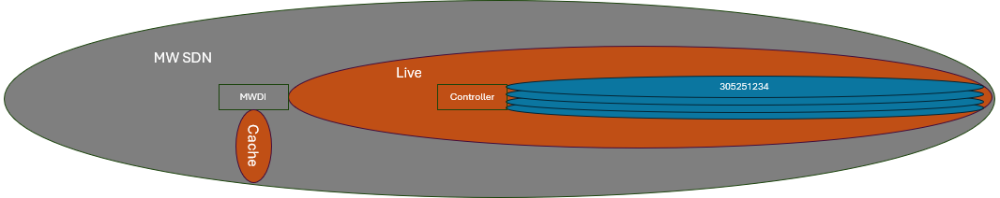  

In folgendem Bild sollen die Terminierungsstellen von Verbindungen noch einmal anhand von ungefähren Zahlen verdeutlicht werden:  

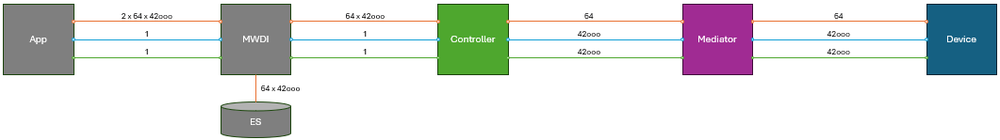  

### Kapselung nicht kontrollierter Schnittstellen

Der verbindungsbasierte Zuschnitt der Domänen bedeutet im Beispiel, dass auch aus den Domänen der Geräte heraus die MountPoints im Controller konfiguriert werden.  
Sollte die Controllersoftware aktualisiert oder durch einen anderen Typ ersetzt werden, würden sich Änderungen an ihrer Managementschnittstelle auf mehrere Domänen auswirken.  
Das wäre nicht ideal.  

**Erkenntnis**  
Elemente, deren Schnittstellenentwicklung wir nicht kontrollieren, sollten innerhalb einer Domäne gekapselt werden.  

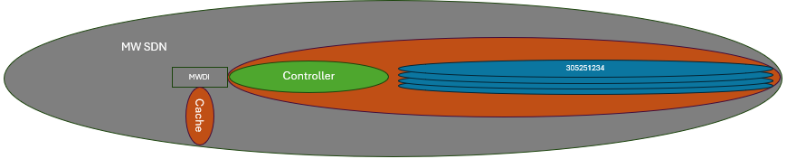  

Hier scheint sich eine mögliche Inkonsistenz aufzutun.  
Einerseits sollte eine Domäne autonom arbeiten und mit generischen Anfragen adressiert werden, andererseits werden Interfaces mit konkreten technischen Attributen benötigt.  

Die Fälle in denen ein konkretes Interface genutzt wird, sind wie folgt abgegrenzt:  
- Der Gegenstand und die Maßnahme auf diesem Gegenstand fallen in den Verantwortungsbereich einer anderen Domäne.  
- Ausschließlich die verantwortliche Domäne darf das konkrete Interface nutzen.  
- Das konkrete Interface wirkt im Sinne eines Services unmittelbar auf den betreffenden Gegenstand, d.h.  
  - die Information wird ausgelesen und synchron zurückgegeben oder  
  - der Konfigurationsversuch wird unmittelbar ausgeführt und synchron beantwortet.  
-	Das konkrete Interface wirkt niemals auf den AdministrativeState (siehe unten) der Applikation; es wird ausschließlich übersetzt und durchgereicht.  

Im Beispiel der Automatisierung des Mountings, wird die Managementschnittstelle des Controllers innerhalb der ControllerDomain gekapselt.  
Die ControllerDomain erstellt die MountPoints und konfiguriert die RestconfServer.  
Lediglich für die Konfiguration der NetconfClients stellt die ControllerDomain einen Service nach extern zur Verfügung.  

Eigentlich werden die Domänen der Geräte durch den MediatorInstanceManager verwaltet.  
Aber auch in diesem Fall haben wir nur eingeschränkte Kontrolle über dessen Funktionen und seine Schnittstelle.  
Zum Beispiel wird die Konfiguration der NetconfClients nicht unterstützt und keine Statusinformationen bereitgestellt.  
Aus diesem Grund wird um alle Domänen der Geräte eine weitere Hülle gebildet.  
Die resultierende DeviceDomain darf den Service für die Konfiguration der NetconfClients an der ControllerDomain exklusiv nutzen.  

Im Falle der Automatisierung des Mountings, werden die Namen und die Veranwortlichkeiten der Applikationen an den veränderten Zuschnitt der Domänen angepasst:  
- Der MountingOrchestrator wird in ControllerDomainManager umbenannt, und verantwortet nun Vorhandensein und Betrieb der RESTCONF Verbindungen vom Controller zu den Applikationen (MicroWaveDeviceInventory, MicroWaveDeviceGatekeeper, NotificationProxy) und die Kapselung der Managementschnittstelle des Controllers.  
- Der NetconfInterfaceManager wird in DeviceDomainManager umbenannt, und verantwortet nun Vorhandensein und Betrieb der SNMP und der NETCONF Verbindungen von den Geräten zum Controller, sowie die Kapselung der Managementschnittstellen an den mediatorVms und den Geräten.  
- Zur Aggregation der beiden Domänen auf dem Operation Layer wird zusätzlich der LiveDomainManager eingeführt. Das MicroWaveDeviceInventory bezieht die Notifications über operativen Status der Verbindung zum Gerät nicht länger vom Controller, sondern vom LiveDomainManager.  

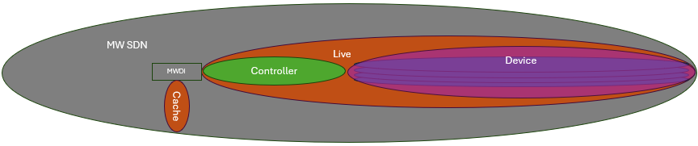  

### Zustandsbasiertes Design

Eingangs wird beschrieben, dass der Aufruf des MountingOrchestrators ursprünglich den Charakter eines Services (z.B. /v1/mount-device) haben sollte.  
Bei Misserfolg, sollte eine aussagekräftige Fehlermeldung zurück gegeben werden.  
Auf Basis der Fehlermeldung sollte eine manuelle Korrektur am Aufbau vorgenommen werden.  

Falls eine Korrektur vorgenommen werden muss, wird sich die ursprüngliche Absicht des Nutzers dadurch nicht ändern, - das Gerät soll gemounted werden.  
Dennoch muss der Nutzer diese Absicht erneut formulieren, und danach unter Umständen weitere Male.  

Dass eine Automatisierung nur dann aktiv wird, wenn sie durch den Serviceaufruf eines Menschen angestoßen wurde, ist ein grundsätzlicher Widerspruch.  

**Erkenntnis**  
Sinnvoller ist, dass der Mensch einen Zielzustand beschreibt und die Automatisierung fortwährend und autonom auf die Herbeiführung dieses Zielzustandes wirkt.  

Im Falle der Automatisierung des Mountings, bedeutet dies:  
- Der Aufruf des RestconfConnectionManager beschreibt nun einen Zielzustand (z.B. /v1/establish-restconf-connection)  
- Der RestconfConnectionManager prüft lediglich, ob dieser Zielzustand grundsätzlich erreicht werden kann (sind Fähigkeiten und Ressourcen vorhanden?)  
- Kann der Zielzustand grundsätzlich erreicht werden, wird eine positive Antwort gesendet  
- Das Erreichen des Zielzustands kann im Anschluss natürlich aus den selben Gründen scheitern wie der ursprüngliche Serviceaufruf  
- Die Gründe des Scheiterns werde jedoch nicht mehr als Ursache für den erfolglosen Abbruch einer Auftragsausführung, sondern als gegenwärtiger Status dargestellt (z.B. "Gerät nicht unter der geplanten IP Adresse erreichbar")  
- Wurde die manuelle Korrektur am Aufbau vorgenommen, ändert sich einfach der Status (z.B. nun "Adminnutzer auf dem Gerät nicht eingerichtet")  

Es ergäbe sich folgender Aufbau einer Applikation zu Automatisierungszwecken:

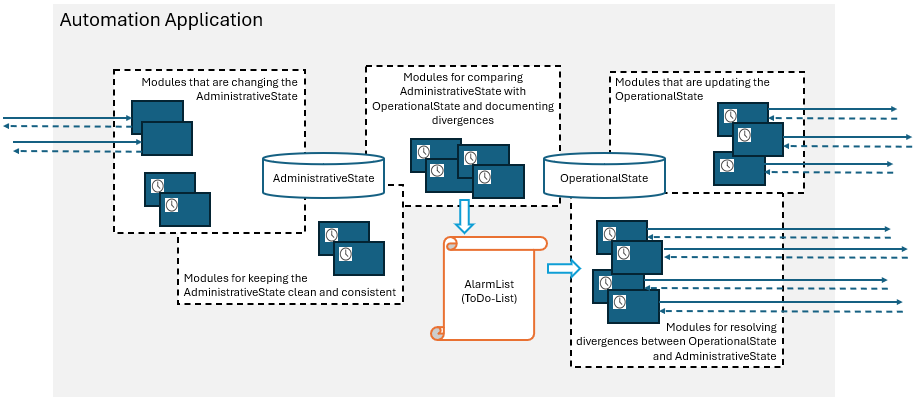  

Autonome Funktionen sind im Diagramm durch Uhren gekennzeichnet.  
Offensichtlich ist lediglich das Validieren und Eintragen in die AdministrativeState Datenbank von außen getriggert.  

**Noch offen - Status der Verbindung zum Gerät**  

Wie im letzten Abschnitt des Kapitels zum Zuschnitt der Domänen angemerkt, soll das MicroWaveDeviceInventory die Notifications über den operativen Status der Verbindung zum Gerät nicht länger vom Controller, sondern von einer Applikation bekommen.  

RestconfConnectionManager, NetconfInterfaceManager und SnmpConnectionManager verantworten jedoch jeweils nur einen Abschnitt der Verbindung zwischen RestconfClient an der MicroWaveDeviceInventory Applikation und dem SnmpServer am Gerät.  

Es gibt keine Domäne, kein LinkObject und folglich auch keinen operativen Status für die Gesamtverbindung.  

Eine Lösung könnte wie folgt aussehen:  

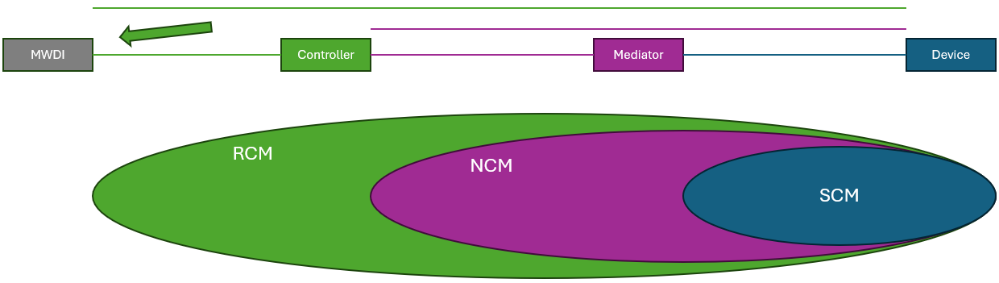  

Wie könnten jedoch die operativen Status der Streckensegemente (RestconfConnection, MountPointFc, NetconfConnection, mMdiatorProcessFc, SnmpConnection) überhaupt gemessen werden?  

Wäre es am Ende vielleicht das Beste, wenn das MicroWaveDeviceInventory den Status des Gesamtverbindung selbst messen würde? (hoffentlich nicht)

### Schlussgedanke

Von Beginn aller Überlegungen zur Automatisierung an, bestand der Einwand, dass das Ergebnis des Zusammenwirkens mehrerer sinnvoller und korrekt implementierter Automatisierungen nicht zwingend ebenfalls sinnvoll sein muss.  
Es erscheint unmöglich sicherzustellen, dass das Zusammenwirken von unabhängig von einander entwickelte lineare Prozesse in jedem denkbaren Fall zu einem sinnvollen Ergebnis führen wird.  
Mit Hilfe des Zustandsbasierten Designs könnte es nun zumindest einen Ansatzpunkt geben.  
Vor dem Schreiben in den AdministrativeState kann überprüft werden, ob der neue Zielzustand sinnvoll wäre.  
Ob es gelingt, die autonom wirkenden Funktionen zur Angleichung des OperationalState an den AdministrativeState so zu gestalten, dass nicht sinnvolle Zwischenzustände zuverlässig automatisch geheilt werden, muss die Erfahrung zeigen.  
