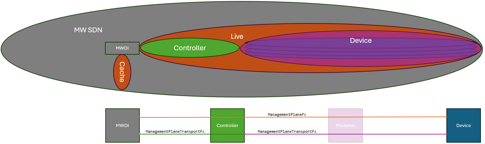
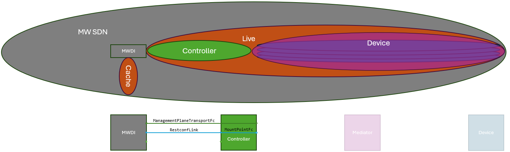
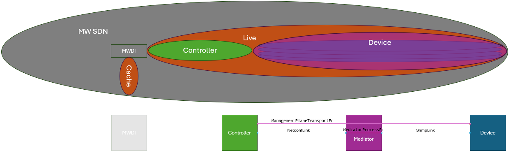
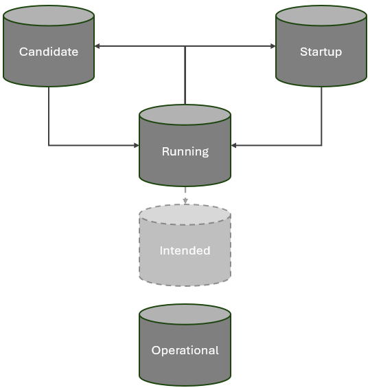
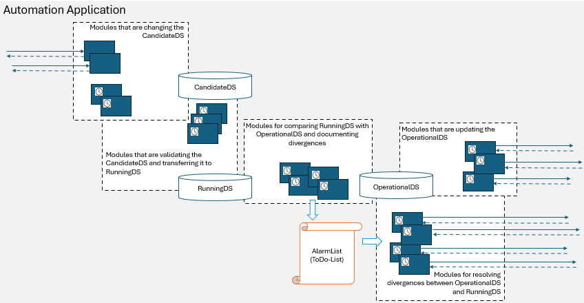

<!--- spell-checker: locale de,en --->

# Entwicklung einer Architektur für Netzwerkautomatisierungsaufgaben

### Vorgeschichte  
Die ersten Überlegungen zur Automatisierung des Mountings wurden bereits Anfang 2021 gemacht.  

Innerhalb der mediatorVMs werden die einzelnen mediatorProcesses durch eine MediatorInstanceManager Funktion verwaltet.  
Für die herstellerspezifischen Implementierungen der MediatorInstanceManager Funktion wurde eine REST Schnittstelle harmonisiert.  
Über diese REST Schnittstelle ist es nun möglich, den MediatorInstanceManager mediatorProcesses erstellen und löschen zu lassen, ohne die gesamte mediatorVM neu starten zu müssen.  
Dieser Schritt kann als Erfolg angesehen werden, da gegenwärtig über Skripte durchschnittlich ca. 3,500 mediatorProcesses pro mediatorVM verwaltet werden.  

Ferner wurde damals angedacht, dass  
- eine MountingOrchestrator Applikation den gesamten Prozess des Mountings steuert, die notwendigen Konfigurationen am Controller vornimmt, und bei Bedarf  
- eine MediatorManager Applikation auffordert einen passenden mediatorProcess durch einen der oben erwähnten MediatorInstanceManager in einer der mediatorVMs erstellen zu lassen.  

  

Im November 2024 wurde die Automatisierung des Mountings erneut angegangen, um damit die Wahrscheinlichkeit einer erfolgreichen Anwendung der automatisierten Abnahme von Links zu steigern.  
Auf Basis der bestehenden Konzepte sollte das Mounting so beschleunigt werden, dass der GU zum Zeitpunkt der Abnahme des Links noch am Standort ist.  

### Linearer Prozess  
Über APT, bzw. den APT-Proxy sollte zunächst der MountingOrchestrator aufgefordert werden, das neue Gerät zu mounten (2.2), bevor die für die Abnahme des Links erforderlichen Daten aus dem Inventory gelesen (3.2) werden.  

  
  
Der Aufruf des MountingOrchestrator (2.2) hatte folgenden Charakter: /v1/mount-device  

Der MountingOrchestrator sollte folgende Aufgaben als linearen Prozesses durchführen:
- Konfigurieren des SDN-Nutzers im Gerät (2.2.1)  
- Erstellen und Konfigurieren des Mediators (2.2.2)  
- Einrichten eines MountPoints am Controller  (2.2.3)  
- Verknüpfen von Planungsdaten mit Netzwerkinventar durch Eintragen von Ne-ID und Link-ID im Gerät (2.2.4)  

  

Im Falle eines Fehlers sollte der MountingOrchestrator den Prozess abbrechen und eine aussagekräftige Fehlermeldung an APTP -> APT -> den Nutzer zurückgeben, so dass dieser am Standort gezielt nachbessern kann.  

Die Fehlermeldungen sollten folgenden Detaillierungsgrad aufweisen:  
- Gerät nicht unter der geplanten IP Adresse erreichbar  
- Gerät nicht über Managementprotokoll erreichbar  
- Admin auf dem Gerät nicht eingerichtet  
- Admin mit einem falschen Passwort eingerichtet  
- ...  

Es zeigte sich, dass für Fehlermeldungen dieser Auflösung weitere Prozessschritte erforderlich sind.  
- Ping-test prüft, ob das Gerät unter der geplanten IP Adresse erreichbar ist (2.1.1a)  
- Protokolltest prüft, ob die notwendigen Freigaben auf den Routern und Firewalls eingerichtet sind (2.1.1b)  
- ...  

Dem Konzept des linearen Prozesses folgend wurde spezifiziert, dass diese Tests ebenfalls durch den MountingOrchestrator durchgeführt werden.  

  

Nach der Spezifikation weniger Schritte zeigte sich:  
- Ein Orchestrator bekommt bei dieser Architektur sehr viele Schnittstellen. Im Fall des MountingOrchestrators unterschieden sich diese Schnittstellen darüber hinaus technologisch (Ping, SNMP, HTTP...) und waren wiederum redundant mit Schnittstellen, die in den spezialisierten Applikationen (z.B. ConnectionPreparation) ohnehin benötigt werden.  
- Der Orchestrator ist durch so gut wie jede Änderung an den äußeren Bedingungen (in diesem Fall an Hardwareausstattung oder Netzdesign) ebenfalls betroffen. D.h. im einzelnen UserDemand verdoppelt sich der Erhaltungsaufwand, da neben der spezialisierten Applikation fast immer auch der Orchestrator aktualisiert werden muss.  
- Werden UserDemands generell als lineare Prozesse umgesetzt, müssen bei Änderungen neben der spezialisierten Applikation (die durch mehrere UserDemands genutzt wird) unter Umständen gleich mehrere Orchestrators aktualisiert werden.  

**Erkenntnis**  
Die Implementierung von UserDemands als lineare Prozesse, die von einem Orchestrator über mehrere Applikationen hinweg gesteuert werden, scheint in der Anschaffung, aber insbesondere im Unterhalt einer zunehmend umfangreichen Umgebung sehr aufwändig und teuer zu sein.  

### Unterstrukturierter Prozess

In einer ersten Überarbeitung des Designs wurden die Funktionen neu auf die Applikationen verteilt.  

Beispiel zur Steigerung der Kohäsion:  
Ping-test und Protokolltest wurden vom MountingOrchestrator in die ConnectionPreparation Applikation verschoben, so dass die dort bereits vorhandenen Interfaces mehrfach verwendet werden können.  

Beispiel zur Reduzierung der Kopplung:  
Bislang bot die ConnectionPreparation Applikation hardwarespezifische Services an (z.B. /v1/prepare-connection-at-ericsson-ml6352).  
Die Auftrennung in separate Services geschah ursprünglich um eine rückwärtskompatible Wartung und Ergänzung um zukünftige Hardwaretypen zu erleichtern.  
Da dabei die Entscheidung darüber, welche herstellerspezifische Methode anzuwenden ist, im MountingOrchestrator platziert wurde, muss dieser z.B. bei Einführung einer neuen Hardware ebenfalls aktualisiert werden.  
Ein zusätzlicher, generischer Service (/v1/prepare-connection) in der ConnectionPreparation Applikation entscheidet nun anhand eines Gerätetyp-Attributes, welcher der hardwarespezifischen Services aufgerufen werden muss.  
Durch diesen Selbstaufruf der ConnectionPreparation Applikation entfällt der Aktualisierungsbedarf am MountingOrchestrator, da dieser nur einen anderen String durchreichen muss.  

  

Ferner wurde berücksichtigt, dass bei wiederholten Versuchen ein Gerät zu mounten das Gerät nicht in jedem Fall erneut vorbereitet werden muss.  
Die Information darüber, ob es vorbereitet werden muss, ist jedoch im MediatorManager, nicht im MountingOrchestrator.  
Unter anderem aus diesem Grund, ist es viel sinnvoller, die ConnectionPreparation Applikation durch den MediatorManager und nicht durch den MountingOrchestrator aufzurufen.  

  

Steigerung der Kohäsion und Reduzierung der Kopplung haben zur Folge, dass die einzelne Applikation nicht länger nur einzelne Arbeitsschritte im Rahmen eines Prozesses ausführt, sondern eine umfassendere Verantwortung bekommt.  

Beispiele:  
  - Die ConnectionPreparation Applikation kümmert sich nun um die gesamte Kommunikation mit dem Gerät bevor es am Controller angebunden ist.  
  - Der MediatorManager stellt nicht länger nur einen Mediator zu Verfügung, sondern das NETCONF Interface und alles was dahinter liegt, da er die Konfiguration des Interfaces auf der Geräteseite ebenfalls vorbereitet und auslöst.  

Aus diesem Grund wurde aus dem MediatorManager der NetconfInterfaceManager und aus dem /v1/provide-mediator der /v1/provide-netconf-interface (2.2.1) Service.  

  

### Domänen  

Im Rahmen der Designdiskussionen wurde klar, dass neben des Mountings neuer Geräte weitere Aufgaben an den betroffenen Elementen (Controller, mediatorVMs, Geräte) zu erledigen sind.  

Beispiele:  
- Durch frühere, auf Skripten basierende Versuche zu Mounten ist es auf einigen Geräten zu einer Verschmutzung gekommen. Es wurden in größerer Anzahl falsche Nutzernamen eingetragen. Eine Hygienefunktion wird benötigt. Diese soll autonom dafür sorgen, dass nur die vorgegebenen Nutzer auf den Geräten konfiguriert sind. Diese Funktion wäre idealerweise ebenfalls in der ConnectionPreparation Applikation untergebracht, da sie die selben Designinformationen und Interfaces zu den Geräten benötigt.  
- Durch die permanente Fortentwicklung des Managementinterfaces, liefert jeder Hardwarehersteller mehrmals im Jahr eine aktualisierte MediatorSoftware.  
Der gegenwärtig genutzte Aktualisierungsprozess führt zu einem stundenlangen Ausfall der Managementanbindung.  
Der NetconfInterfaceManager könnte durch Aufrufen der vorhandenen Create- und Delete-Services der MediatorInstanceManager auch den Umzug von mediatorProcesses von einer alten zu einer neuen mediatorVm automatisieren und zumindest nahezu unterbrechungsfrei gestalten.  

Diese Beispiele zeigen, wie durch den Aufruf der selben Services auf der selben Gruppe untergeordneter Elemente unterschiedliche übergeordnete Ziele (UserDemands) umgesetzt werden können.  
D.h. die Steigerung der Kohäsion hat nicht nur Einfluss auf die Anordnung der Funktionen eines UserDemands, sondern befördert auch, dass eine Applikation an einer ganzen Reihe von UserDemands beteiligt ist, oder diese sogar eigenständig implementiert.  

Im Falle des NetconfInterfaceManagers zeigte sich, dass die zur Umsetzung der unterschiedlichen UserDemands benötigten Funktionen große Überschneidungen aufweisen.  
z.B. eine Funktion für das Erstellen eines Mediators wird für die Automatisierung des Mountings, die Gleichverteilung der mediatorProcesses über die mediatorVMs, die Automatisierung des Updates der MediatorSoftware, einen Schutz gegen den Crash von MediatorVMs und eventuell weitere UserDemands benötigt.  

Das bedeutet, dass auch innerhalb der Applikationen Serviceaufrufe, bzw. autonom ausgeführte UserDemands nicht als lineare Prozesse, sondern als Zusammenwirken von wiederverwendbaren Modulen umgesetzt werden sollten.  
Da diese Module für mehrere UserDemands benötigt werden, werden sie offenkundig nicht von außen angestoßen, sondern durch ein internes Ereignis.  
Sie werden von den Applikationen quasi "in Eigenverantwortung" genutzt.  

Um die Wiederverwendbarkeit von Modulen zu verbessern, kann es sich ergeben, dass das auslösende interne Ereignis nicht mehr in unmittelbarem Zusammenhang mit dem einzelnen UserDemand steht.  

Müssen z.B. im Zusammenhang mit dem Rückbau physikalischer Geräte, der Gleichverteilung der mediatorProcesses über die mediatorVMs oder der Automatisierung der Updates der MediatorSoftware nicht mehr benötigte mediatorProcesses gelöscht werden, könnte das interne Ereignis darin bestehen, dass im Rahmen einer regelmäßigen Prüfung des Bestandes ein nicht mehr benötigter mediatorProcess gefunden wurde.  

**Erkenntnis**  
Konsequentes Optimieren der Architektur hinsichtlich Aufwand und Kosten (durch Steigern der Kohäsion und Reduzieren der Kopplung) führt schließlich zur Bildung von Domänen die relativ autonom agieren.  
Da mehrere Funktionen innerhalb der Domänen parallel wirken, besteht kein 1:1 Zusammenhang zwischen einem äußeren Serviceaufruf (oder einem UserDemand) und einer Funktion zu seiner vollständigen Umsetzung mehr.  
Würde man einen UserDemand (z.B. die Automatisierung des Mountings) als linearen Prozess denken, wäre es vermutlich sehr schwierig nachzuvollziehen, ob alle darin enthaltenen Schritte "irgendwo" abgedeckt sind.  

### Zuschnitt der Domänen  

Beispiel:  
- Wie oben beschrieben, soll der NetconfInterfaceManager einen idealerweise unterbrechungsfreien Prozess zur Aktualisierung der MediatorSoftware implementieren.  
- Hintergrund:  
  - Das MicroWaveDeviceInventory wird vom Controller über Änderungen am Zustand der Managementanbindungen informiert.  
  - Erhält das MicroWaveDeviceInventory eine Notification über das Abreißen einer Managementanbindung, löscht es das betroffene Gerät sofort aus dem Cache.  
  - Das Laden des Datenbaumes eines Gerätes in den Cache dauert im Durchschnitt etwa 8 Minuten.  
  - Das Laden der Datenbäume aller Geräte, die über eine mediatorVM angebunden sind, dauert etwa 2 Stunden.  
- Würde der NetconfInterfaceManager ein neues NETCONF Interface an einer neuen mediatorVM generieren lassen und den MountingOrchestrator auffordern den MountPoint im Controller so umzukonfigurieren, dass dieser auf das neue NETCONF Interface zeigt, käme es während der Konfigurationsänderung zu einer Unterbrechung der NETCONF Verbindung, und der Controller würde eine entsprechende Notifications senden.  
- Offensichtlich ist nicht ideal, dass MountingOrchestrator und NetconfInterfaceManager die Endstellen der NETCONF Verbindungen konfigurieren und der Controller die Notifications über deren OperationalState in den restlichen Applikationsschicht sendet.  

  

Eine effektivere Kontrolle erscheint möglich. Hierfür sollte ...  
- die vollständige Verbindungen (nicht nur Interfaces) innerhalb einer Domäne verantwortet werden  
- der Domaincontroller (hier eine Applikation) nicht nur die Konfiguration beider Endstellen der Verbindungen vornehmen, sondern auch darüber entscheiden, welche Notifications von der Domäne nach außen gegeben werden.  

**Erkenntnis**  
Beim Zuschnitt der Domänen sollte in Verbindungen, nicht in Endstellen, gedacht werden.  

Operation Domains:  
Innerhalb des ApplicationPatterns werden die Pfade, die auf einer API angeboten oder in Callbacks aufgerufen werden, als OperationServer und OperationClient Objekte verwaltet.  
- Wenn eine beliebige Applikation innerhalb der MW SDN Domäne das MicroWaveDeviceInventory adressiert, um Informationen über ein Gerät zu bekommen, geschieht dies über einen Pfad (OperationServer), der wie folgt strukturiert ist:  
/core-model-1-4:network-control-domain=live/control-construct={mountName}/equipment={uuid}  
Offensichtlich befinden sich unterhalb des MicroWaveDeviceInventory die zwei Subdomänen Cache und Live, die parallel neben einander existieren.  
- Wenn die Anfrage über einen OperationClient des MicroWaveDeviceInventory in die Live Domäne übertragen wird, ist der Pfad wie folgt strukturiert:  
/rests/data/network-topology:network-topology/topology=topology-netconf/node={mountName}/yang-ext:mount/core-model-1-4:control-construct/equipment={uuid}  
Innerhalb dieses Pfades werden zwei neue Ebenen von Subdomänen aufgespannt.
  - Es werden Domänen für verschiedene Protokolle unterschieden.  
  Da wir gegenwärtig ausschließlich NETCONF nutzen, wird diese Zwischenebene nicht weiter betrachtet.  
  - Innerhalb der NETCONF Domäne wird für jedes der Geräte eine eigene Domäne aufgespannt.  
- Sobald die Anfrage über den MountPoint im Controller in die Domäne eines der Geräte übertragen wurde, ist der Pfad wie folgt strukturiert:  
/core-model-1-4:control-construct/equipment={uuid}

Innerhalb der Domäne eines Gerätes ist eine Unterscheidung in Live und Cache unbekannt, dass weitere Geräte parallel existieren könnten, ist ebenfalls unbekannt.  
Als Folge der Translation im Mediator könnte sich nicht nur der Pfad, sondern auch die Anzahl der Requests ändern.  
Da sich der Informationsraum jedoch nicht ändert, soll hier keine Domaingrenze definiert werden.  

Würden die Domänen wie hier dargestellt strukturiert werden, würde weder auf dem OperationLayer noch darunter eine Verbindung durchschnitten werden:  

  

In folgendem Bild soll die Baumstruktur der Verbindungen noch einmal anhand ihrer ungefähren Anzahlen verdeutlicht werden:  

  

### Kapselung nicht kontrollierter Schnittstellen

Der auf Verbindungen basierende Zuschnitt der Domänen bedeutet im Beispiel:  
- Die NETCONF Verbindungen werden durch die Domänen der Geräte verwaltet.  
- Aus den Domänen der Geräte heraus würden hierfür die NetconfClients in den MountPoints im Controller konfiguriert werden müssen.  
- Änderungen an der Managementschnittstelle der ControllerSoftware würden sich nicht nur auf jene Domäne, die den Controller als gesamtes verwaltet, sondern auch auf die Domänen der Geräte auswirken.  
Das wäre nicht ideal.  

**Erkenntnis**  
Elemente, deren Schnittstellenentwicklung wir nicht kontrollieren, sollten innerhalb einer Domäne gekapselt werden.  
Für Aspekte, die außerhalb dieser Domäne verwaltet werden, müssen Services bereitgestellt werden, die technisch konkret sind, die Spezifika der nicht kontrollierten Schnittstelle jedoch abstrahieren.  

  

Hier scheint sich eine mögliche Inkonsistenz aufzutun.  
Einerseits sollte eine Domäne autonom arbeiten und mit generischen Anfragen adressiert werden, andererseits werden Schnittstellen mit konkreten technischen Attributen benötigt.  

Die Fälle, in denen eine technisch konkrete Schnittstelle genutzt wird, sind wie folgt abgegrenzt:  
- Der Aspekt und die Maßnahme auf diesem Aspekt fallen in den Verantwortungsbereich einer anderen Domäne.  
- Ausschließlich die für einen Aspekt verantwortliche Domäne darf die technisch konkrete Schnittstelle nutzen.  
- Die technisch konkrete Schnittstelle wirkt im Sinne eines Services unmittelbar auf den betreffenden Aspekt, d.h.  
  - die Information wird ausgelesen und synchron zurückgegeben oder  
  - der Konfigurationsversuch wird unmittelbar ausgeführt und synchron beantwortet.  
-	Die technisch konkrete Schnittstelle wirkt niemals direkt oder indirekt auf den RunningDS (siehe unten) der Applikation; es wird ausschließlich übersetzt und durchgereicht.  

Im Beispiel der Automatisierung des Mountings, wird die Managementschnittstelle des Controllers innerhalb der ControllerDomain gekapselt.  
Die ControllerDomain erstellt die MountPoints und konfiguriert die RestconfServer.  
Lediglich für die Konfiguration der NetconfClients stellt die ControllerDomain einen Service nach extern zur Verfügung.  

Eigentlich werden die Domänen der Geräte durch den MediatorInstanceManager verwaltet.  
Aber auch in diesem Fall haben wir nur eine eingeschränkte Kontrolle über dessen Funktionen und seine Schnittstellen.  
Beispielsweise werden weder die Konfiguration der NetconfClients in den MountPoints noch die Bereitstellung von Statusinformationen unterstützt.  
Aus diesem Grund wird um alle Domänen der Geräte eine weitere Hülle gebildet.  
Die resultierende DeviceDomain implementiert die benötigten Funktionen für alle Geräte und darf dabei den Service für die Konfiguration der NetconfClients an der ControllerDomain exklusiv nutzen.  

Im Falle der Automatisierung des Mountings, werden die Namen und die Verantwortlichkeiten der Applikationen an den veränderten Zuschnitt der Domänen angepasst:  
- Der MountingOrchestrator wird in ControllerDomainManager umbenannt, und verantwortet nun Vorhandensein und Betrieb der RESTCONF Verbindungen vom Controller zu den Applikationen (MicroWaveDeviceInventory, MicroWaveDeviceGatekeeper, NotificationProxy) und die Kapselung der Managementschnittstelle des Controllers.  
- Der NetconfInterfaceManager wird in DeviceDomainManager umbenannt, und verantwortet nun Vorhandensein und Betrieb der SNMP und der NETCONF Verbindungen von den Geräten zum Controller, sowie die Kapselung der Managementschnittstellen an den mediatorVms und den Geräten.  
- Zur Aggregation der beiden Domänen auf dem OperationLayer wird zusätzlich der LiveDomainManager eingeführt.  

Zu Beginn des Kapitels "Zuschnitt der Domänen" wurde beschrieben, dass eine Aktualisierung der MediatorSoftware zu einer Entleerung des MicroWaveDeviceInventory führt.  
Dieses Problem wird nun dadurch gelöst, dass das MicroWaveDeviceInventory die Notifications über den OperationalState der Verbindung zum Gerät nicht länger vom Controller, sondern vom LiveDomainManager bezieht.  
Die Umstände, unter denen der LiveDomainManager eine solche Notification sendet, kann nun in seiner Spezifikation bestimmt werden.  

  

### Bestimmung des OperationalState  

Die Bereitstellung von Verbindungen ist eine Kernaufgabe der Domänen.  
Aus der Motivation der Automatisierung des Mountings heraus, sind die Fälle, in denen die Managementverbindung zum Gerät (noch) nicht funktioniert, von besonderem Interesse.  
Der OperationalState von Verbindungen muss effizient festgestellt und repräsentiert werden.  

In einem zyklischen Prozess werden folgende Schritte durchlaufen:  
- Der LiveDomainManager fragt den jeweiligen OperationalState der beiden ManagementPlaneTransport Verbindungen bei der ControllerDomain und der DeviceDomain ab.  
- Er berechnet daraus den aktuellen OperationalState der ManagementPlane Verbindung.  
- Er vergleicht den aktuellen OperationalState mit dem vorherigen.  
- Sollte sich eine Änderung ergeben haben, sendet der LiveDomainManager eine AttributeValueChanged Notification an das MicroWaveDeviceInventory.  

Die Periodizität dieses zyklischen Prozesses soll konfigurierbar sein.  
Es wird davon ausgegangen, dass bei ausreichend hoher Periodenlänge, der Umschaltmoment beim Umzug eines mediatorProcesses im Rahmen eines Updates ausreichend häufig keine Notification auslöst.  

#### LiveDomain

Vereinfachung:  
Eigentlich müsste für jeden OperationClient am MWDI eine Operation Verbindung instantiiert und ein zugehöriger OperationalState dokumentiert werden.  
Die Operation Verbindungen zwischen MicroWaveDeviceInventory und Gerät haben jedoch alle stets den identischen OperationalState (, außer die Operations sind auf dem Gerät oder im Mediator unvollständig unterstützt).  
Zur Vereinfachung wird ein zusätzlicher Verbindungstyp, der die gesamte Managementverbindung (inklusive aller Operationen) zum Gerät repräsentiert, eingeführt.  

In der LiveDomain wird die Managementverbindung zum Gerät durch die ManagementPlane Verbindung repräsentiert.  
Sie beginnt am MicroWaveDeviceInventory und endet am Gerät.  
Sie wird auf Verbindungen vom Typ ManagementPlaneTransport geroutet.  
Die ManagementPlaneTransport Verbindungen stellen die durch die darunter liegenden Domänen bereitgestellten Pfadsegmente dar.  
Eine ManagementPlane Verbindung ist available, wenn alle ManagementPlaneTransport Verbindungen auf denen sie geroutet ist, available sind.  

| Name | Startpunkt | Endpunkt | ClientLayer | ServingLayer |  
| ---- | ---------- | -------- | ----------- | ------------ |  
| ManagementPlaneFc | ManagementPlaneClient im MWDI | ManagementPlaneServer im Gerät | ./. | ManagementPlaneTransportFc |
| ManagementPlaneTransportFc | ManagementPlaneTransportClient im MWDI | ManagementPlaneTransportServer im mediatorProcess | ManagementPlaneFc | ./. |  
| ManagementPlaneTransportFc | ManagementPlaneTransportClient im mediatorProcess | ManagementPlaneTransportServer im Gerät | ManagementPlaneFc | ./. |  

  

#### ControllerDomain

In der ControllerDomain ist die ManagementPlaneTransport Verbindung die oberste.  
Sie beginnt am MicroWaveDeviceInventory und endet am NetconfClient im MountPoint.  
Sie wird auf Verbindungen vom Typ RestconfLink und MountPointFc geroutet.  
Ein ManagementPlaneTransport Verbindung ist available, wenn die Restconf Verbindung available ist, und der MountPointFc existiert.  
Ob die Restconf Verbindung available ist, wird geprüft, indem ein Dienst, der einen Callback zum Controller auslöst, am MicroWaveDeviceInventory aufgerufen wird.  

| Name | Startpunkt | Endpunkt | ClientLayer | ServingLayer |  
| ---- | ---------- | -------- | ----------- | ------------ |  
| ManagementPlaneTransportFc | ManagementPlaneTransportClient im MWDI | ManagementPlaneTransportServer im MountPoint | ./. | RestconfLink, MountPointFc |  
| RestconfLink | RestconfClient im MWDI | RestconfServer im MountPoint | ManagementPlaneTransportFc | ./. |  
| MountPointFc | RestconfServer im MountPoint | NetconfClient im MountPoint | ManagementPlaneTransportFc | ./. |  

  

#### DeviceDomain  

In der DeviceDomain ist ebenfalls die ManagementPlaneTransport Verbindung die oberste.  
Hier beginnt sie am NetconfClient im MountPoint und endet am Gerät.  
Sie wird auf der NETCONF Verbindung, der SNMP Verbindung und dem MediatorProcess geroutet.  
Die ManagementPlaneTransport Verbindung ist available, wenn der MountPoint im 'Connected' State ist.  
Sollte die ManagementPlaneTransport Verbindung nicht available sein, wird der OperationalState der darunter liegenden Ebenen wie folgt gemessen:  
- Sollte kein mediatorProcess existieren, gelten NETCONF Verbindung, SNMP Verbindung und MediatorProcess als unavailable.
- Sollte ein mediatorProcess existieren, wird dieser mit einem NetconfClient der DeviceDomäne zu Testzwecken angesprochen
  - Sollte das Gerät korrekt antworten, gilt die NETCONF Verbindung als unavailable, und die SNMP Verbindung und der MediatorProcess gelten als available.  
  - Sollte das Gerät nicht korrekt antworten, gilt die SNMP Verbindung als unavailable, und die NETCONF Verbindung und der MediatorProcess gelten als available.  

| Name | Startpunkt | Endpunkt | ClientLayer | ServingLayer |  
| ---- | ---------- | -------- | ----------- | ------------ |  
| ManagementPlaneTransportFc | ManagementPlaneTransportClient im mediatorProcess | ManagementPlaneTransportServer im Gerät | ./. | NetconfLink, MediatorProcessFc und SnmpLink |  
| NetconfLink | NetconfClient im MountPoint | NetconfServer im mediatorProcess | ManagementPlaneTransportFc | ./. |  
| MediatorProcessFc | NetconfServer im mediatorProcess | SnmpClient im mediatorProcess | ManagementPlaneTransportFc | ./. |  
| SnmpLink | SnmpClient im mediatorProcess | SnmpServer im Gerät| ManagementPlaneTransportFc | ./. |  

  

### State Based Design

Eingangs wird beschrieben, dass der Aufruf des MountingOrchestrators ursprünglich den Charakter eines Services (z.B. /v1/mount-device) haben sollte.  
Bei Misserfolg, sollte eine aussagekräftige Fehlermeldung zurück gegeben werden.  
Auf Basis der Fehlermeldung sollte eine manuelle Korrektur am Aufbau vorgenommen werden.  

Falls eine Korrektur vorgenommen werden muss, wird sich die ursprüngliche Absicht des Nutzers dadurch nicht ändern, - das Gerät soll an die SDN Domäne angebunden sein.  
Dennoch muss der Nutzer diese Absicht erneut formulieren, und danach unter Umständen weitere Male.  

Dass eine Automatisierung nur dann aktiv wird, wenn sie durch den Serviceaufruf eines Menschen angestoßen wurde, ist ein grundsätzlicher Widerspruch.  

**Erkenntnis**  
Sinnvoller ist, dass der Mensch einen Zielzustand beschreibt und die Automatisierung fortwährend und autonom auf die Herbeiführung dieses Zielzustandes wirkt.  
Das fortwährende Wirken hin zu einem Zielzustand, der noch nicht herrscht, erfordert diesen zu speichern.  
Bzgl. Struktur, Bedeutung, Verwaltung und Namensgebung soll sich die Struktur der internen Speicher an der Network Management Datastore Architecture (NMDA - [IETF RFC 8342](https://datatracker.ietf.org/doc/html/rfc8342)) orientieren.  

  

RunningDS  
Beschreibung des Zielzustandes im flüchtigen Speicher der Domäne.  

StartupDS  
Nichtflüchtige Kopie des RunningDS, die beim Neustart geladen wird.  

CandidateDS  
In diese Kopie des RunningDS werden die Änderungswünsche zunächst eingetragen.  
Dann werden sie im Gesamtkontext validiert.  
Nach erfolgreicher Validierung wird der Inhalt des CandidateDS in den RunningDS kopiert.  

OperationalDS  
Beschreibung des Istzustandes im flüchtigen Speicher der Domäne.  

IntendedDS
Eine wichtige Funktion einer Domäne ist der permanente Vergleich des Inhalts des RunningDS mit dem des OperationalDS.  
Sollte eine wichtige Funktion einer Domäne darin bestehen, ein Element mit nicht-kontrollierter Schnittstelle zu kapseln, könnte man die Information im OperationalDS gemäß dieses Elementes strukturieren.  
In diesem Fall sollte der Inhalt des RunningDS ebenfalls gemäß dieses Elementes strukturiert und in einem IntendedDS abgespeichert werden.  
Auf diese Weise muss die Übersetzung nicht bei jedem Vergleich erneut durchgeführt werden.  
Das IntendedDS wird also nur benötigt, wenn die Struktur der Informationen im OperationalDS nicht mit der im RunningDS übereinstimmt.  

Hier ist das Grundprinzip noch einmal am Beispiel des ControllerDomainManagers erklärt:  
- Der LiveDomainManager ruft den ControllerDomainManager mit der abstrakten Beschreibung eines Zielzustands auf (z.B. /v1/establish-restconf-connection).  
- Der ControllerDomainManager erstellt einen frischen CandidateDS mit den Informationen des RunningDS.  
- In den CandidateDS trägt er nun die konkreten Änderungen, die zum Erreichen des gewünschten Zielzustands erforderlich sind, ein. (Während der Aufruf darin bestand, irgendeine RESTCONF Verbindung zu etablieren, würde nun ein konkreter MountPoint im CandidateDS angelegt werden.)  
- Nun prüft der ControllerDomainManager, ob der resultierende Inhalt der CandidateDS ein legaler Zielzustand sein wird.  
  - Sollte die Prüfung zu einem negativen Ergebnis führen, beantwortet der ControllerDomainManager die Anfrage des LiveDomainManager mit einem Fehlercode.  
  - Sollte die Prüfung zu einem positiven Ergebnis führen, beantwortet der ControllerDomainManager die Anfrage des LiveDomainManager mit 204 und der Inhalt des CandidateDS wird in den RunningDS kopiert.  
- Im weiteren Verlauf stellen die Module des ControllerDomainManager eine (weitere) Abweichung zwischen dem RunningDS und dem OperationalDS fest und versuchen die Abweichung durch Konfiguration der untergeordneten Elemente zu beseitigen.  
- Das Erreichen des Zielzustands kann im Anschluss natürlich aus den selben Gründen scheitern wie der  Serviceaufruf im ursprünglichen Design.  
- Die Gründe des Scheiterns werde jedoch nicht mehr als Ursache für den erfolglosen Abbruch einer Auftragsausführung dargestellt. Statt dessen wird aus der Abweichung zwischen dem RunningDS und dem OperationalDS ein Eintrag in der internen Alarmliste abgeleitet, und die Fehlermeldung des untergeordneten Elementes an diesen Eintrag angeheftet.  
- Sollte sich die Ursache für die Abweichung zwischen dem RunningDS und dem OperationalDS über die Zeit ändern, wird der Eintrag in der Alarmliste aktualisiert.  

Vermeidung redundanter Informationen  
Sollte ein Interface gestört sein, ist es die Verbindung, die es abschließen soll, in der Regel ebenfalls.  
D.h. in der internen Alarmliste könnte prinzipiell sowohl das Interface als auch die Verbindung als das gestörte Element referenziert werden.  
Aufgrund des auf Verbindungen basierenden Zuschnitts der Domänen sollte jedoch die Verbindung als gestörtes Element referenziert werden.  
Da an jedem Verbindungsobjekt, jene Verbindungen, über die es geroutet ist, gelistet werden, lassen sich die Alarme, die eine Verbindung auf höherer Ebene betreffen, schnell ermitteln.  
Für diesen Zweck hat jede Domäne einen Service anzubieten, der sämtliche Alarme listet, die eine Verbindung oder jene Verbindungen, auf die sie geroutet ist, betreffen.  

Es ergäbe sich folgender Aufbau einer Applikation zu Automatisierungszwecken:

  

Autonome Funktionen sind im Diagramm durch Uhren gekennzeichnet.  
Offensichtlich ist lediglich das Validieren und Eintragen in die CandidateDS von außen getriggert.  

### Schlussgedanke

Von Beginn aller Überlegungen zur Automatisierung an, bestand der Einwand, dass das Ergebnis des Zusammenwirkens mehrerer sinnvoller und korrekt implementierter Automatisierungen nicht zwingend ebenfalls sinnvoll sein muss.  
Es erscheint unmöglich sicherzustellen, dass das Zusammenwirken von unabhängig von einander entwickelte lineare Prozesse in jedem denkbaren Fall zu einem sinnvollen Ergebnis führen wird.  
Mit Hilfe des State Based Designs könnte es nun zumindest einen Ansatzpunkt geben, da vor dem Kopieren des Inhalts des CandidateDS in den RunningDS der gesamte neue Zielzustand überprüft werden kann.  

Ob es gelingt,  
- die Prüfungen, die für eine zuverlässige Stabilität erforderlich sind, ausreichend vollständig zu beschreiben
- und die Algorithmen, die das System von einem stabilen Zustand in den nächsten überführen sollen, so zu formulieren, dass dies entweder fehlerfrei geschieht, oder aufgetretene Fehler zuverlässig automatisch geheilt werden,  

muss die Erfahrung zeigen.  

