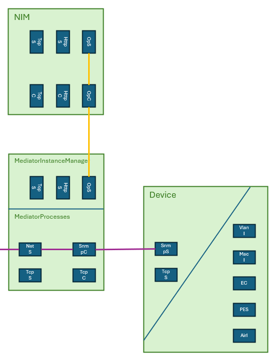

# Network Topology Representation  

**Problem**  
The xMediatorInstanceManager is not a complete application of the MW SDN application layer; it is only a REST interface for managing basic functions of the translation software provided by the hardware vendors.  
For example, the xMIM does not represent its network context according to the ONF information model.  

**Solution**  
The MediatorManager acts as a wrapper around the entire provisioning of the NETCONF interfaces. Among other things, it determines the network topology established for the provisioning of the NETCONF interfaces and informs the ApplicationLayerTopology application about it.  

Like all other applications, the MediatorManager informs the ApplicationLayerTopology about changes to its own interfaces and connections (marked orange in the figure below) by sending updates to the following services  
- ALT://v1/update-all-ltps-and-fcs (substituted by response to app://v1/redirect-topology-change-information)
- ALT://v1/update-ltp  
- ALT://v1/delete-ltp-and-dependents  
- ALT://v1/update-fc  
- ALT://v1/update-fc-port  
- ALT://v1/delete-fc-port  

In addition to that, **the MediatorManager also mimics all mediatorVms and all devices** and informs the ApplicationLayerTopology about changes to their interfaces and connections (marked violet in the picture below), too.  

  

**Externally triggered changes to the internal data structure**  

Whenever its MM://v1/regard-mediator-instance-manager service is addressed, it  
- creates a [mediatorVM in its internal data structure](./schemas/MediatorVmSchema.yaml) that is referencing one of the existing [mediatorVmTemplates](./schemas/MediatorVmTemplateSchema.yaml)  
- addresses the ALT://v1/regard-application for updating the ALT  

Whenever its MM://v1/provide-netconf-interface service is addressed, it  
- creates a [device in its internal data structure](./schemas/DeviceSchema.yaml)  
- addresses the ALT://v1/regard-device*) for updating the ALT  
- adds a [mediatorProcess inside one of the mediatorVMs in its internal data structure](./schemas/MediatorProcessSchema.yaml)  
- addresses the ALT://v1/update-ltp and ALT://v1/update-fc services for documenting the mediatorProcess in the ALT  
- connects the newly created mediatorProcess and device with a [link in its internal data structure](./schemas/LinkSchema.yaml)  
- addresses the ALT://v1/add-snmp-client-to-link service*) for documenting the same link in the ALT  

Whenever its MM://v1/dismantle-netconf-interface service is addressed, it  
- searches through all mediatorVMs and deletes all mediatorProcesses for the defined device from its internal data structure  
- updates the ALT by addressing ALT://v1/delete-ltp-and-dependents as often as required  
- deletes the defined device from its internal data structure  
- addresses the ALT://v1/disregard-device*) for deleting the device from the ALT  

Whenever its MM://v1/disregard-mediator-instance-manager is addressed, it  
- deletes the mediatorVM from its internal data structure  
- addresses the ALT://v1/disregard-application for deleting the mediatorVM from the ALT  

**Internally triggered changes to the internal data structure**  

The MediatorManager reads the xMIM://v1/list-mediator-instances service at all the mediatorVMs it is aware of at a configurable interval.  
If it detects a mismatch with its internal data structure, it calls the service MM://v1/provide-netconf-interface or MM://v1/dismantle-netconf-interface to correct it.  

*) these services do not yet exist and have to be added to the ApplicationLayerTopology  
