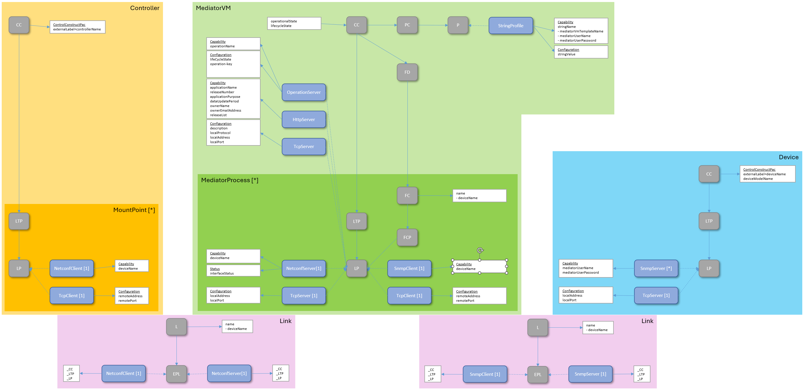

# Network Topology Representation  

**Problem**  
The xMediatorInstanceManager is not a complete application of the MW SDN application layer; it is only a REST interface for managing basic functions of the translation software provided by the hardware vendors.  
For example, the xMIM does not represent its network context according to the ONF information model.  

**Solution**  
The MediatorManager acts as a wrapper around the entire provisioning of the NETCONF interfaces. Among other things, it determines the network topology established for the provisioning of the NETCONF interfaces.  

Like all other applications, the MediatorManager informs the ApplicationLayerTopology about changes to its own interfaces and connections by sending updates to the following services  
- ALT://v1/update-all-ltps-and-fcs (substituted by response to app://v1/redirect-topology-change-information)
- ALT://v1/update-ltp  
- ALT://v1/delete-ltp-and-dependents  
- ALT://v1/update-fc  
- ALT://v1/update-fc-port  
- ALT://v1/delete-fc-port  

In addition to that, **the MediatorManager also mimics the xMediatorInstanceManagers** at the mediatorVMs and informs the ApplicationLayerTopology about their creation and changes to their interfaces.  
The MM is automatically creating the LinkObjects to the xMIMs and is informing the ALT also about those.  

The MM is sending records to the ExecutionAndTraceLog as the xMIMs would do, if they would fully integrate into the MW SDN application layer.  

In its internal data, the MM is documenting an even more complete picture of the network that is required for connecting the Controller with the devices, but this network segment is encapsulated and does not get notified to the ALT or MO.  

  

**Internal Data Structure**  
The MM's internal data structure is an [own NetworkControlDomain](./schemas/DomainSchema.yaml) that is successively filled with additional objects.

Whenever its MM://v1/regard-controller service is addressed, it  
- creates a [controller in its internal data structure](./schemas/ControllerSchema.yaml)  

Whenever its MM://v1/regard-mediator-instance-manager service is addressed, it  
- creates a [mediatorVM in its internal data structure](./schemas/MediatorVmSchema.yaml) that is referencing one of the existing [mediatorVmTemplates in the AppDATA](./schemas/AppDataSchema.yaml)  
- addresses the ALT://v1/regard-application for updating the ALT  

Whenever its MM://v1/provide-netconf-interface service is addressed, it  
- creates a [mountPoint at the defined controller in its internal data structure](./schemas/MountPointSchema.yaml)  
- creates a [device in its internal data structure](./schemas/DeviceSchema.yaml)  
- and adds the device to its internal createNetconfInterface queue  

Whenever the MM executes its private /p1/create-netconf-interface service, it  
- adds a [mediatorProcess inside one of the mediatorVMs in its internal data structure](./schemas/MediatorProcessSchema.yaml)  
- adds an [snmpLink between mediatorProcess and device in its internal data structure](./schemas/SnmpLinkSchema.yaml)  
- updates the mountPoint with the TCP/IP address of the newly created mediatorProcess
- adds a [netconfLink between mountPoint and mediatorProcess in its internal data structure](./schemas/NetconfLinkSchema.yaml)  

Whenever its MM://v1/dismantle-netconf-interface service is addressed, it  
- searches the netconfLink for the defined mountName and deletes it and the referenced mountPoint and mediatorProcess
- searches for snmpLinks for the defined mountName and deletes them and the referenced device and mediatorProcesses (if there would still exist one or several)  

Whenever its MM://v1/disregard-mediator-instance-manager is addressed, it  
- deletes the mediatorVM from its internal data structure  
- addresses the ALT://v1/disregard-application for deleting the mediatorVM from the ALT  

 