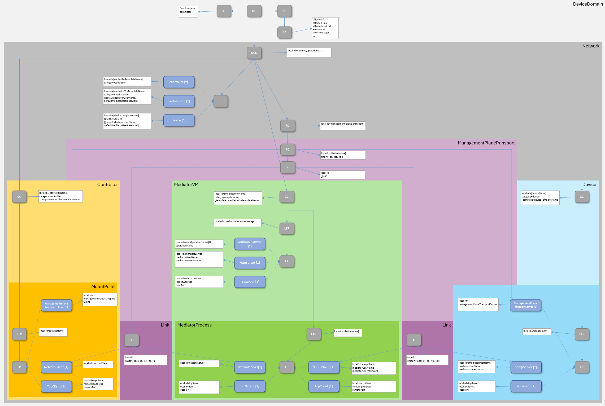

# DeviceDomainManager Information Structure  

The internal data stores shall be structured according to the NMDA concepts ([IETF RFC 8342](https://datatracker.ietf.org/doc/html/rfc8342)).

The specified data stores are assigned the following semantic meanings:  
- The external services (paths in the API) allow addressing abstractly expressed changes to the target state (, e.g. "device shall be connected"). These abstract intents are interpreted and expressed in concrete logical objects inside the CandidateDateStore.  
- After successfully passing validation, these intents get copied into the RunningDataStore, which represents basically the configuration or target state of the network.  
- The information provided by the devices in the live network (via MWDI, usually from the cache) is consolidated in the OperationalDataStore, which essentially represents the current state of the network.  

  

The information within the three data stores shall have the following identical structure:  

  

The [DomainController (DC)](./schemas/00_DomainController.yaml) holds  
- the parameter settings of the [Functions (F)](./schemas/01_Function.yaml),  
- definitions of [ValidationSequences (VS)](./schemas/03_ValidationSequence.yaml),  
- definitions of [ErrorCodes (EC)](./schemas/05_ErrorCode.yaml) including their countermeasures,  
- and the [CurrentAlarms (CA)](./schemas/02_CurrentAlarm.yaml) at the DeviceDomainManager.  

Four semantically different documentations of the same [Network (NCD)](./schemas/03_NetworkControlDomain.yaml) (running, operational, startup and candidate) are composed from instances of,   
- pre-defined templates (Profiles)  
  - [ControllerTemplate (P)](./schemas/05_ControllerTemplate.yaml)  
  - [MediatorVmTemplate (P)](./schemas/06_MediatorVmTemplate.yaml)  
  - [DeviceTemplate (P)](./schemas/07_DeviceTemplate.yaml)  
- network elements (ControlConstructs) with interfaces (LogicalTerminationPoints)  
  - [Controllers (CC)](./schemas/11_Controller.yaml) incl. [MountPoint (LTP)](./schemas/12_MountPoint.yaml)  
  - [MediatorVms (CC)](./schemas/21_MediatorVm.yaml) incl. [MediatorProcess (LTP)](./schemas/22_MediatorProcess.yaml)  
  - [Devices (CC)](./schemas/31_Device.yaml)  
- and connections (Links and ForwardingConstructs).  
  - [NetconfConnection (L)](./schemas/81_NetconfConnection.yaml)  
  - [SnmpConnection (L)](./schemas/82_SnmpConnection.yaml)  
  - [ManagementPlaneTransportConnection (FC)](./schemas/88_ManagementPlaneTransportConnection.yaml)  
