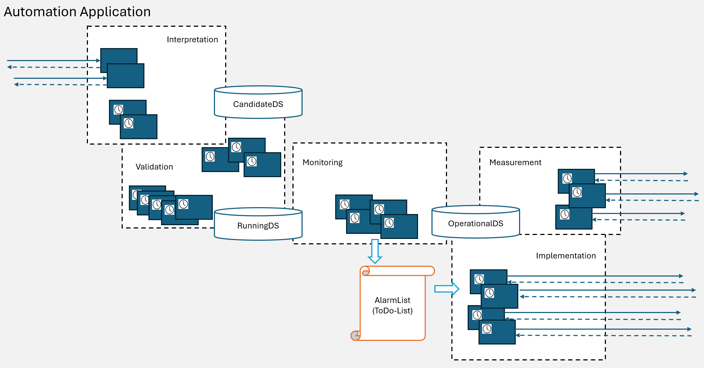

# DeviceDomainManager List of Functions  

  

. 
-  
. 
-  
_muss von LILW nach DDM angepasst werden_
-  
. 
-  


### Interpretation  
_(potentially it would make sense to facilitate multiple microwave links being passed in a single request;_  
_would that comply with the status of the consuming application?)_
- /v1/add-planned-microwave-link  
  - Copies content of RunningDS into CandidateDS  
  - Creates the specified CC objects and AirInterface LTPs in CandidateDS (may already be in place)  
  - Creates an FC object between the specified CCs in CandidateDS (may already be in place)  
  - Creates a new Link object between the specified AirInterface LTPs in CandidateDS  
  - Calls v1-validation-orchestrator  
  - IF ResponseCode==204  
    - Copies content of CandidateDS into RunningDS  
    - Responds 204 to requestor  
    ELSE  
    - Responds ResponseCode to requestor  
- /v1/remove-planned-microwave-link  
  - Copies content of RunningDS into CandidateDS  
  - Deletes the Link object with the specified LinkID from CandidateDS  
  - Deletes all FC objects that do not reference any Link object from CandidateDS  
  - Deletes all CC objects that are not referenced by any FC object from CandidateDS  
  - Calls v1-validation-orchestrator  
  - IF ResponseCode==204  
    - Copies content of CandidateDS into RunningDS  
    - Responds 204 to requestor  
    ELSE  
    - Responds ResponseCode to requestor  

### Validation  
- v1-validation-orchestrator  
  - Calls a configurable set of the TestFunctions listed below  
  - IF all ResponseCodes==204  
    - Responds 204  
    ELSE  
    - Responds the first ResponseCode different from 204 and terminates  
- v1-ensure-unique-link-ids  
  Ensures that each LinkID is unique in the list of planned microwave links  

_(further examples to be potentially removed by ApplicationOwner:)_
- v1-prevent-redundant-fcs  
  Ensures that each pair of CCs is referenced by a maximum of one FC object  
- v1-prevent-redundant-links  
  Ensures that each pair of AirInterface LTPs is referenced by a maximum of one Link object  
- v1-ensure-every-fc-having-at-least-one-link
  Ensures that each FC object is referencing at least one Link object  

### Measurement  
- v1-calculate-ltp-external-label (cyclic operation)  
  - Picks next FC object from rolling list in RunningDS  
  - Updates OperationalDS by reading the necessary information about all AirInterface LTPs and the Equipment of the referenced devices from MWDI  
  - IF device cannot be found in MWDI
    - Creates an entry with ErrorCode [to be defined#1] that is referencing the FC object and the CC object (as in RunningDS) in the CurrentAlarms  
    - Deletes existing FC object, referenced Link objects, affected CC object and attached AirInterface LTPs from OperationalDS  
    - Terminates calculation of externalLabel for this FC  
  - Creates Link objects between these AirInterface LTPs in OperationalDS (may already be in place; some may even be deleted, if AirInterface LTPs couldn't be found)  
  - Updates FC object between the two CC objects in OperationalDS  
  - Reads the LinkIDs of all Link objects referenced by the FC object in RunningDS  
  - Adds these LinkIDs into the Score tables at all Link objects in OperationalDS (may already be in place)  
  - Calculates the Scores for all LinkIDs at all Link objects referenced by the picked FC object and write them into the Score tables in OperationalDS  
    - IF device data is incomplete and Scores cannot be calculated  
      - Creates an entry with ErrorCode [to be defined#2] that is referencing the FC object, the affected CC and AirInterface LTP (as in RunningDS) in the CurrentAlarms  
      - Deletes existing Scores for all LinkIDs at all Link objects referenced by the picked FC object in OperationalDS  
      - Does not delete existing entries in the calculatedLinkId attribute at the Link objects referenced by the picked FC in OperationalDS  
      - Terminates calculation of externalLabel for this FC  
  - Calculates the most likely distribution of the LinkIDs on the Link objects referenced by the picked FC object and write the results into the calculatedLinkId attribute at the Link objects in OperationalDS (some may stay empty)  
  - Compares calculatedLinkId attribute at the Link object with the externalLabel attributes at both referenced AirInterface (all in OperationalDS)  
    - IF externalLabel != calculatedLinkId  
      - creates an entry with ErrorCode [to be defined#3] that is referencing the Link object and the AirInterface LTP in the CurrentAlarms  
      ELSE  
      - Checks CurrentAlarms at Link object and AirInterface LTP for potentially existing entries with ErrorCode [to be defined#3] and deletes them  

### Monitoring  
- ./. (cyclic operation)  

_(further examples to be potentially removed by ApplicationOwner:)_
- v1-check-if-cc-external-label-equal-to-mount-point  
- v1-check-if-operational-tx-power-is-below-planned  

### Implementation  
- v1-implementation-orchestrator (cyclic operation)  
  - Picks next FC object from rolling list in CurrentAlarms  
  - Identifies errored object and checks dateOfNextAttemptToFix  
    - IF currentDate > dateOfNextAttemptToFix  
      - Increments dateOfNextAttemptToFix  
      - Calls predefined ImplementationFunction depending on the ErrorCode and pastAttemptsToFix  
  - Documents response into pastAttemptsToFix

- v1-update-ltp-external-label  
  - Reads calculatedLinkId attribute from Link and mountName + AirInterfaceUuid from AirInterface in OperationalDS
  - Sends PUT request to MWDG://live/mountName/AirInterfaceUuid/externalLabel with calculatedLinkId from Link in Operational  
    - IF ResponseCode==204
      - Sends ResponseCode=204
      ELSE
      - Sends ErrorCode [to be defined#3]

### Concepts for defining ImplementationFunctions  
During discussions we found out that:  
- With increasing number of deviations between RunningDS and OperationalDS some deadlock might occur.  
- It is unclear how roll-back of partly executed implementation sequences could be defined in case of idempotent functions.  

The following concepts should help minimizing the risk of dead lock and partly executed implementation sequences:  
- Implementation sequences should be short (this is why the information structure is now limiting to a single function).  
- Each implementation sequence shall terminate in a stable state more close to the target state defined in the RunningDS.  
- Steps that are increasing the options in the total system (e.g. releasing limited resources) shall be done first. Steps that are narrowing down the options in the total system (e.g. allocating resources) shall be done in a separated sequence later.  

. 
-  
. 
-  
_von DDM_
-  
. 
-  


# List of Functions


### Interpretation and Validation (>58)

- v1-create-controller-template
  - v1-create-controller-template-validation
    - ...
- v1-delete-controller-template
  - v1-delete-controller-template-validation
    - ...
- v1-list-controller-templates

- v1-create-mediator-vm-template
  - v1-create-mediator-vm-template-validation
    - v1-confirm-number-of-processes-less-than-limit
    - ...
- v1-delete-mediator-vm-template
  - v1-delete-mediator-vm-template-validation
    - v1-confirm-template-not-being-operational
    - ...
- v1-list-mediator-vm-templates

- v1-create-device-template
  - v1-create-device-template-validation
    - ...
- v1-delete-device-template
  - v1-delete-device-template-validation
    - ...
- v1-list-device-templates


- v1-regard-controller
  - v1-regard-controller-validation
    - ...
- v1-disregard-controller
  - v1-disregard-controller-validation
    - ...
- v1-list-controllers

- v1-regard-mediator-vm
  - v1-regard-mediator-vm-validation
    - ...
- v1-disregard-mediator-vm
  - v1-disregard-mediator-vm-validation
    - ...
- v1-list-mediator-vms

- v1-list-devices


- v1-establish-management-plane-transport
  - v1-regard-device
    - v1-regard-device-validation
      - ...
  - v1-regard-mount-point
    - v1-regard-mount-point-validation
      - ...
  - v1-establish-management-plane-transport-validation
    - ...
  - v1-create-route
    - v1-create-mediator-process
      - v1-create-mediator-process-validation
        - ...
    - v1-establish-snmp-link
      - v1-establish-snmp-link-validation
        - ...
    - v1-establish-netconf-link
      - v1-establish-netconf-link-validation
        - ...
    - v1-create-route-validation
      - ...
- v1-dismantle-route
  - v1-dismantle-netconf-link
    - v1-dismantle-netconf-link-validation
      - ...
  - v1-dismantle-snmp-link
    - v1-dismantle-snmp-link-validation
      - ...
  - v1-dismantle-mediator-process
    - v1-dismantle-mediator-process-validation
      - ...
  - v1-dismantle-route-validation
    - ...
- v1-dismantle-management-plane-transport
  - v1-disregard-mount-point
    - v1-disregard-mount-point-validation
      - ...
  - v1-disregard-device
    - v1-disregard-device-validation
      - ...
  - v1-dismantle-management-plane-transport-validation
    - ...


### Measurement (6)

List of measurements we could do:
- Getting the list of available **Controllers** from the ControllerDomainController
- Getting the list of available **MountPoints** at a Controller from the ControllerDomainController
- Detecting the availability of a **ManagementPlaneTransport connection** by 
Getting the connection state of a MountPoint from the ControllerDomainController
- Detecting the availability of a **MediatorVM** by addressing it with some request (e.g., /v1/list-mediator-instances)
- Getting the list of available **MediatorProcesses** from the MediatorVM
- Detecting the availability of an **SNMP connection** by addressing a NETCONF request to its MediatorProcesses
- Detecting the availability of a **Device** by addressing it by Ping

The measurements is organized from top to bottom.  
If the higher layer is available, the lower layers are assumed to be available, too.  
If the higher layer is not available, measurement is drilling down.  
```
here is a problem with alternative routes  
```

This translates into the following functions:

- v1-detect-management-plane-transport-state
  - cdm-v1-inform-about-mount-point

  if not existing:
  - v1-detect-controller-state
    - cdm-v1-provide-list-of-controllers
  - v1-detect-mount-point-state
    - cdm-v1-provide-list-of-mount-points-at-controller

  if management-plane-transport not available, execute for each route:
  - v1-detect-link-states
    - NetconfClient->MediatorProcess://control-construct/control-construct-pac/external-label

    if snmp-link available: netconf-link := unavailable  
    if snmp-link not available:  
    - v1-detect-mediator-state
      - xmim-v1-list-mediator-instances

      if not responding: MediatorVM := unavailable  
      if MediatorProcess not listed: MediatorProcess := unavailable  
      else:
      - v1-detect-device-state
        - PingClient->TcpServer of Device


### Management and Implementation


hier gehts weiter => 


- v1-alert-unavailable-management-plane-transport
  - v1-alert-unavailable-device
    - cp-v1-prepare-connection
  - v1-alert-unavailable-mount-point
    - _v1-dismantle-management-plane-transport
  - v1-alert-unavailable-route
    - v1-alert-unavailable-mediator-process
      - xmim-v1-provide-mediator-instance
      - cdm-v1-update-tcp-client
    - v1-alert-unavailable-snmp-link
    - v1-alert-unavailable-netconf-link
      - cp-v1-update-netconf-client
      - cp-v1-update-tcp-client

- v1-alert-obsolete-management-plane-transport
  - v1-alert-obsolete-device
  - v1-alert-obsolete-mount-point
  - v1-alert-obsolete-route
    - v1-alert-obsolete-mediator-process
    - v1-alert-obsolete-snmp-link
    - v1-alert-obsolete-netconf-link

- v1-list-alarms-on-connection


