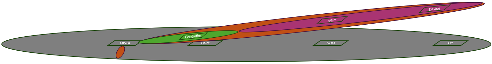
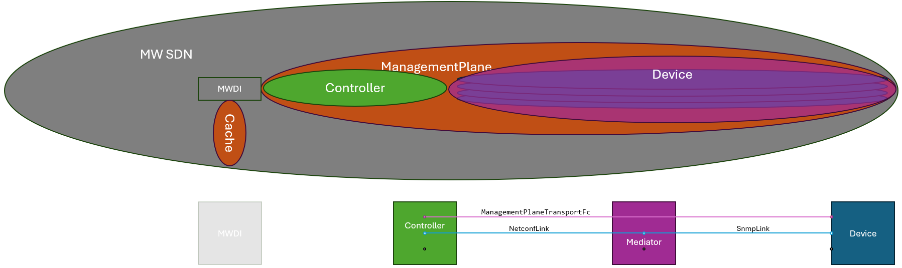

# Domain Contents  
_(This is a conceptual document that is not directly part of the DDM specification.  
It reflects the status as of early May 2025 and has not been updated since that time.)_  

We cannot control the management interfaces and functions of the xMediatorInstanceManager and the Controller.  
While both elements are present within our network infrastructure, they do not integrate into the MW SDN application layer.  
As a result, we encapsulate them into sub-domains.  

The ManagementPlane (domain) and its sub-domains are now spanning a network composed from controllers including mountPoints, mediatorVMs including mediatorProcesses and devices.  
These elements are managed within these domains, but this management is done by applications (e.g. ControllerDomainManager, DeviceDomainManager, ConnectionPreparation, ManagementPlaneManager).  

These applications do not belong to the ManagementPlane or its sub-domains, but to the MW SDN domain.  
They are fully integrated into the MW SDN domain's management, which is executed by the TinyApplicationController.  

  

# Network Topology inside the DeviceDomainManager  

The DeviceDomainManager application encapsulates all instances of xMediatorInstanceManager.  
In contrary to former concepts, the DeviceDomainManager will not mimic the xMediatorInstanceManagers towards the ApplicationLayerTopology or the ExecutionAndTraceLog.  
It will document the network topology inside its domain and expose an abstracted view to the ManagementPlaneManager application.  
The documentation of the network topology inside the DeviceDomainManager shall follow the NMDA concepts.  

  

The detailed definition of the DeviceDomainManager's internal data structure can be found [here](../InformationStructure/InformationStructure.md).